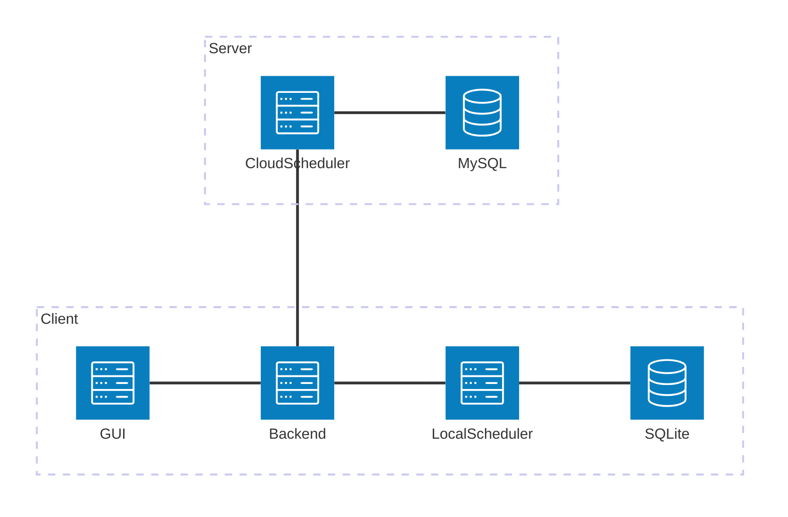

# 设计灵感
生活中的时间管理工具（Todolist）大多功能单一，仅限"记录"，并不会进行"管理"，也就是代替用户对某个或某些任务进行安排。而时间管理最大的问题就是"时间管理"这个行为本身相当浪费时间。
故此，我做出该设计，在任务列表的基础上设计这个系统，以CPU调度算法为基础设计任务调度工具，自动完成对任务的合理安排。

## 竞品简析
- 可以说毫无例外的，所有Todelist类（课程表，日程表等）工具，都不会主动对用户的任务加以安排。即使有，也大多是工业软件，没有产品化或不便于常规甚至于轻量级用户使用
- 完全没有例外的，所有有"优先级设置"功能的工具，优先级设计要么优先级档位少，不利于精细化设置，要么优先级档位多，不利于用户模糊选择，增加了决策和思考成本，不利于轻量级用户使用

## 创新点
1. 通过调度算法主动安排任务
2. 通过一套优先级选择算法，优化优先级选择的用户体验
3. 服务端额外部署服务器，接受所有（愿意使用的）用户的脱敏数据，训练（无画像的）通用AI调度（不一定会实现）

## 目标受众
- 轻量级用户，不想手动管理时间或不想要粗略的优先级划分，难以理解复杂的任务依赖关系、调度策略、数值机制
- 以自动化为目标的用户，不想时间花在时间管理这件事上

### 解决方案
#### 特色功能一：
（根本）精细数字优先级（保证精度）+（基础）模糊优先级区间选择（便于大致选择优先级区间位置）+（改进）比较式优先级选择（相对优先级，直观，符合直观逻辑）+（进阶）直接数值填写（究极精度，满足进阶用户）

#### 特色功能二：
自动调度（根据选择的算法）

#### 特色功能三：
结合番茄钟与的地点记录表的时间默认值管理

# 核心功能
- 特色优先级选择机制
- 基于调度算法（轮转调度算法，短作业有限算法，先来先服务算法，优先级调度算法……）实现本地时间管理（简单说为每个任务安排具体执行的日期和时间段）

# 其余功能

## 客户端
1. SQLite数据库
2. 支持复杂任务信息的录入
    - 次数任务
    - 周期任务
    - ……
3. 时间管理小工具：
    - 番茄钟（辅助时间管理）
    - ……
4. 显示：
    - 任务列表（列表视图 + 月度视图）
    - 必要界面（任务调度，任务统计，任务管理CRUD，番茄钟，调度算法切换）
    - 任务反馈（满意度等）
    - ……
5. 可选的任务调度算法
    - 轮转调度、短作业优先、先来先服务……

## 服务端（作为可选功能/可选实现功能）
1. 智能时间管理算法（基于机器学习或强化学习的AI时间管理方案，不保留或使用用户信息）
2. 上传匿名数据，返回调度结果
3. 上传的匿名数据用于AI训练学习（参数包括满意度，任务调度后情况等）

# 任务数据结构

## 初步设计

- 任务基础信息
    - 任务ID（不可重复，不可空，自动生成）字面意思
    - 名称（可重复，可空）字面意思
    - 描述（可重复，可空）字面意思
    - 优先级（不可重复，不可空）详见下文 ## 优先级选择算法 部分
    - 任务tag（可重复，可空）

- 任务时间信息
    - 起止时间
        - 开始时间（可空，缺省值=任务创建时间）
        - 结束时间（可空）为空则为无限制任务/定次数任务，完成全部次数即为完成
    - 单次预计时间（可重复，可空，分钟，缺省值=60分钟）即完成 1 次任务所需的大致时间
    - 地点（可重复，可空）字面意思
    - 通勤时间（可重复，可空，缺省值）字面意思，手动设置/系统猜测（调度时计入任务时长）
        - 系统猜测：假设上一个1小时内完成的任务的地点为当前地点
            - 基础：缺省值 == (当前地点 != 任务地点 ? 30分钟 : 5分钟)
            - 进阶：“地点路由”，记录用户 **手动设定**  的两个不同地点之间的通勤时间
    - 休息时间（可空，缺省值=5分钟）“多次任务的某次任务”/“单次任务“前后留出的休息时间（调度时计入任务时常）

- 复杂任务支持(三维度)：
    1. 周期
        - （为空状态）与起止时间一致
        - （非空状态1）独立周期（比如，每3天、每1月、每5小时等“时间长度”）
        - （非空状态2）复合周期（比如，每周三和周四等“某时间长度内的多个时间点”）
    2. 完成次数（非空）
        - 一次（n = 1）
        - n次
        - 不定次（由系统计算 起止时间之间的有效周期 个数，用户无需人工计算或设定）
    3. 时间段
        - （非空状态）任务有具体的时间点或时间段（即不可调度调整的任务，比如课程或特定时间段的会议、报告等）
        - （为空状态）任务没有时间点或时间段要求（即可以调度调整的任务，比如只知道deadline的课堂作业或活动）

    - 复杂任务举例
        1. 课程型任务。从1月2日至5月2日的每周三下午1:30至3:30
            - 周期：每周三
            - 完成次数：不定次（实际可算，只是用户不输入）
            - 时间段：下午1:30至3:30
        2. 某个学分活动。4月15日中午12:00截止
            - 周期：空（起止时间，即需要在结束时间前完成）
            - 完成次数：1次
            - 时间段：空（无要求）

# 技术栈选择
- 用户端
    - 前端 Vue + Element + JavaScript
    - 后端 Python + SQLite
- 服务端
    - Java Spring Boot + Python + MySQL

# 设计部分

## 系统架构设计

文字描述：
    用户操作客户端前端，客户端前端连接客户端后端，客户端后端进行SQLite数储和调度。客户端后端通过API访问服务端服务，服务端进行AI调度及MySQl存储历史用于机器学习。

图表展示：（以下为mermaid的架构图，符合最新语法）

## 优先级选择算法

### 基本思路

#### 思路
- 系统（预设）：
    1. 划分若干数字优先级（精细数值，任意数量，不可相同，非数据结构，纯数字用于比较，建议5000以上）
    2. 将若干优先级划分为若干区间（远小于数字优先级数量，3~5个即可），作为大致的优先级选择（模糊选择）
        - 额外分配一档（大小与上述档位大小一致或为平均值，防止数字超出上限）
    3. 用户设置相同优先级区间的任务时，先来的分配该区间较大的数字优先级，后来的分配该区间较小的数字优先级，差值为step
        - 该步调节可跨档，因为根本是数字优先级，优先级区间（大档）无所谓
    - 区间、区间范围以及数字优先级数量可配置，不影响底层逻辑。
- 用户：
    -  选择优先级
        - 方法零：部分任务，如固定时间段的任务无需优先级（比如课程不可能允许调度，所以优先级无用）
        - 方法一：直接选择大致优先级
        - 方法二：使用比较级，“比xxx任务优先/不优先”
            - 更加优先则设为最近的更大的未被使用的数字
            - 更不优先则设为最近的更小的未被使用的数字
            - 不考虑step大小，只考虑大小最接近且未被使用
        - 方法三：直接设置具体数字优先级（对于进阶用户）

#### 特点
1. 优先级本质：仅作为纯数值用于任务排序，无物理空间或索引含义。
2. 用户层抽象：在数值之上构建模糊区间选择和比较式优先级机制，降低用户操作复杂度。

#### 示例（仅是示例）
1. 系统（预设）：
    1. 划分数字优先级3000档
    2. 划分大致优先级三档，低、中、高
    3. 低档分配数字优先级0~1000，中档分配数字优先级1001~2000，高档分配数字优先级2001~3000，额外分配数字优先级3001~4000
    4. 设置优先级step，step大小远小于数字优先级，50倍左右。如若数字优先级右边3000档则step为60左右。（用于之后留空间插入相对任务）

2. 用户（在系统设定后）：
    - 方法0: 固定时间段的任务,无需设置，不可调整，没有优先级
    - 方法1: 选择大致优先级区间，低/中/高。按照先创建的优先级更高的原则，从  该档最高优先级 - step  的位置开始排序。(保证比较式优先级有空可插)
        - 比如上述条件下第一个任务选择 中 优先级区间，则优先级为 1000-60  =940，第二个添加的任务为  940-60  =880。
    - 方法2：（已有其他任务的前提下）选择已有任务，选择”更高/更低“优先级。
        - 比如已有任务优先级2000，选择该2000优先级任务，选择更高，则本任务优先级为2001，下一个任务更高则为2002，若2002已占则为2003
    - 方法3： 直接输入优先级数字，不可重复
        - 比如直接输入2345作为优先级