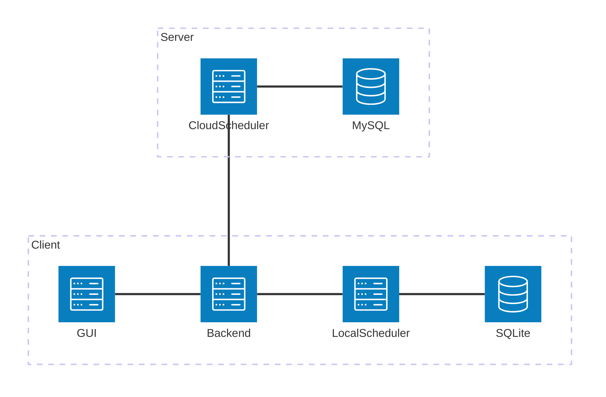

# 系统架构设计

用户操作客户端前端，客户端前端连接客户端后端，后端进行SQLite数储和调度。后端通过API访问服务端服务，服务端进行AI调度及MySQl存储。

```mermaid
architecture-beta
    group client[Client]

    service db(database)[SQLite] in client
    service lscheduler(server)[LocalScheduler] in client
    service frontend(server)[GUI] in client
    service backend(server)[Backend] in client
    
    frontend:R -- L:backend
    backend:R -- L:lscheduler
    db:L -- R:lscheduler

    group server[Server]
    service cscheduler(server)[CloudScheduler] in server
    service cdb(database)[MySQL] in server

    backend:T -- B:cscheduler
    cdb:L -- R:cscheduler
```