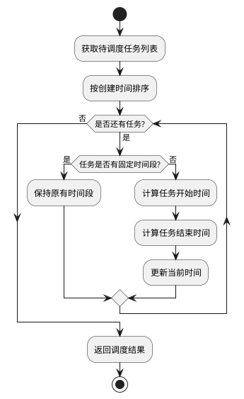

# 先来先服务算法 (FCFS) 设计

## 算法概述
先来先服务（First Come First Serve，FCFS）是一种最简单的调度算法，它按照任务创建时间的先后顺序进行调度。这种算法模拟了现实生活中的排队现象，先到的任务先得到服务。

## 算法特点
1. 公平性：按照任务创建时间顺序执行，不偏袒任何任务
2. 简单性：实现简单，易于理解和维护
3. 非抢占式：一旦任务开始执行，就会一直执行到完成

## 算法流程


## 关键实现细节

### 1. 任务排序
```python
sorted_tasks = sorted(tasks, key=lambda x: x['created_at'])
```
- 使用Python的sorted函数
- 按照任务的created_at字段排序
- 保持原始任务列表不变

### 2. 时间计算
```python
# 开始时间计算
commute_time = task['time_info']['commute_time'] or 0
task['scheduled_start'] = current_time + timedelta(minutes=commute_time)

# 结束时间计算
duration = task['time_info']['estimated_duration']
rest_time = task['time_info']['rest_time'] or 5
task['scheduled_end'] = task['scheduled_start'] + timedelta(minutes=duration + rest_time)
```
- 考虑通勤时间
- 考虑任务持续时间
- 考虑休息时间

## 算法优缺点

### 优点
1. 实现简单，易于理解
2. 公平对待所有任务
3. 适合任务时长相近的场景
4. 不需要复杂的优先级计算

### 缺点
1. 可能导致短任务等待长任务完成
2. 平均等待时间可能较长
3. 不适合任务时长差异大的场景
4. 没有考虑任务优先级

## 使用场景
1. 任务时长相近的情况
2. 对响应时间要求不高的场景
3. 需要公平调度的场景
4. 任务之间没有优先级差异

## 注意事项
1. 需要合理设置任务时长估计
2. 考虑通勤时间的影响
3. 预留适当的休息时间
4. 注意固定时间段任务的处理 