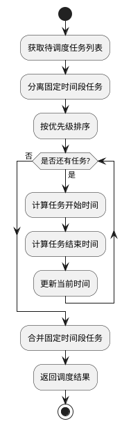

# 优先级调度算法 (Priority) 设计

## 算法概述
优先级调度（Priority Scheduling）是一种基于任务优先级进行调度的算法，它根据任务的优先级数值来决定执行顺序，优先级高的任务优先执行。这种算法能够反映任务的重要性和紧急程度。

## 算法特点
1. 优先级驱动：根据任务优先级决定执行顺序
2. 灵活性：支持动态调整优先级
3. 重要性：反映任务的重要程度

## 算法流程


## 关键实现细节

### 1. 任务分类
```python
# 分离固定时间段任务和灵活任务
flexible_tasks = [t for t in tasks if not t['complex_info']['time_slot']]
fixed_tasks = [t for t in tasks if t['complex_info']['time_slot']]
```
- 区分固定时间段任务
- 保持固定时间段任务原有时间
- 只对灵活任务进行调度

### 2. 优先级排序
```python
# 按优先级排序（优先级数值越大，优先级越高）
sorted_tasks = sorted(flexible_tasks, key=lambda x: x['priority'], reverse=True)
```
- 使用任务的priority字段
- 从高到低排序
- 优先处理高优先级任务

### 3. 时间计算
```python
# 开始时间计算
commute_time = task['time_info']['commute_time'] or 0
task['scheduled_start'] = current_time + timedelta(minutes=commute_time)

# 结束时间计算
duration = task['time_info']['estimated_duration']
rest_time = task['time_info']['rest_time'] or 5
task['scheduled_end'] = task['scheduled_start'] + timedelta(minutes=duration + rest_time)
```
- 考虑通勤时间
- 考虑任务持续时间
- 考虑休息时间

## 算法优缺点

### 优点
1. 反映任务重要性
2. 支持动态优先级调整
3. 适合任务重要性差异明显的场景
4. 可以处理紧急任务

### 缺点
1. 可能导致低优先级任务饥饿
2. 需要合理的优先级设置
3. 优先级可能随时间变化
4. 可能影响系统公平性

## 使用场景
1. 任务重要性差异明显的场景
2. 需要处理紧急任务的场景
3. 支持动态优先级调整的场景
4. 任务优先级可以准确评估的场景

## 注意事项
1. 合理设置优先级范围
2. 防止低优先级任务饥饿
3. 考虑优先级动态调整
4. 平衡重要性和公平性 