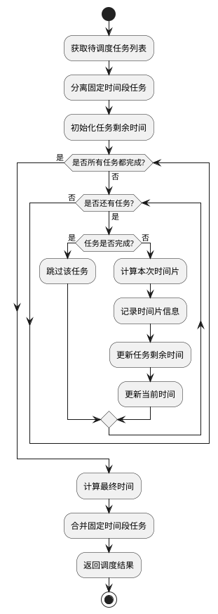

# 轮转调度算法 (RR) 设计

## 算法概述
轮转调度（Round Robin，RR）是一种抢占式调度算法，它为每个任务分配一个固定的时间片，按顺序执行，时间片用完后切换到下一个任务。这种算法确保了所有任务都能得到公平的执行机会。

## 算法特点
1. 公平性：每个任务都能获得执行时间
2. 抢占式：任务可以被中断
3. 时间片：固定大小的执行时间单位

## 算法流程


## 关键实现细节

### 1. 任务初始化
```python
# 初始化任务剩余时间和时间片列表
for task in flexible_tasks:
    task['remaining_time'] = task['time_info']['estimated_duration']
    task['slices'] = []  # 存储任务的时间片
```
- 记录任务剩余时间
- 创建时间片存储列表
- 保持原始任务信息

### 2. 时间片分配
```python
# 计算本次时间片
slice_duration = min(time_slice, task['remaining_time'])

# 记录时间片
slice_start = current_time
slice_end = slice_start + timedelta(minutes=slice_duration)
task['slices'].append({
    'start': slice_start,
    'end': slice_end
})
```
- 考虑任务剩余时间
- 记录时间片起止时间
- 更新任务剩余时间

### 3. 时间计算
```python
# 更新当前时间（考虑休息时间）
rest_time = task['time_info']['rest_time'] or 5
current_time = slice_end + timedelta(minutes=rest_time)

# 计算最终时间
for task in flexible_tasks:
    if task['slices']:
        task['scheduled_start'] = task['slices'][0]['start']
        task['scheduled_end'] = task['slices'][-1]['end']
```
- 考虑休息时间
- 计算任务总时间
- 合并时间片信息

## 算法优缺点

### 优点
1. 公平对待所有任务
2. 避免长任务阻塞短任务
3. 适合交互式任务
4. 响应时间可预测

### 缺点
1. 上下文切换开销
2. 时间片大小难以确定
3. 可能增加平均等待时间
4. 不适合实时任务

## 使用场景
1. 需要公平分配时间的场景
2. 交互式任务较多的场景
3. 任务时长差异大的场景
4. 需要避免长任务阻塞的场景

## 注意事项
1. 合理设置时间片大小
2. 考虑上下文切换开销
3. 注意任务优先级
4. 优化时间片分配策略 