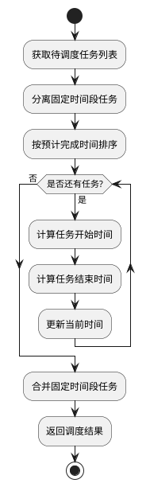

# 短作业优先算法 (SJF) 设计

## 算法概述
短作业优先（Shortest Job First，SJF）是一种非抢占式调度算法，它优先调度预计完成时间较短的任务。这种算法旨在最小化平均等待时间，提高系统整体效率。

## 算法特点
1. 效率性：优先处理短任务，减少平均等待时间
2. 非抢占式：任务一旦开始执行就会完成
3. 预测性：需要准确的任务时长估计

## 算法流程


## 关键实现细节

### 1. 任务分类
```python
# 分离固定时间段任务和灵活任务
flexible_tasks = [t for t in tasks if not t['complex_info']['time_slot']]
fixed_tasks = [t for t in tasks if t['complex_info']['time_slot']]
```
- 区分固定时间段任务
- 保持固定时间段任务原有时间
- 只对灵活任务进行调度

### 2. 任务排序
```python
# 按预计完成时间排序
sorted_tasks = sorted(flexible_tasks, key=lambda x: x['time_info']['estimated_duration'])
```
- 使用任务的estimated_duration字段
- 从小到大排序
- 优先处理短任务

### 3. 时间计算
```python
# 开始时间计算
commute_time = task['time_info']['commute_time'] or 0
task['scheduled_start'] = current_time + timedelta(minutes=commute_time)

# 结束时间计算
duration = task['time_info']['estimated_duration']
rest_time = task['time_info']['rest_time'] or 5
task['scheduled_end'] = task['scheduled_start'] + timedelta(minutes=duration + rest_time)
```
- 考虑通勤时间
- 考虑任务持续时间
- 考虑休息时间

## 算法优缺点

### 优点
1. 最小化平均等待时间
2. 提高系统吞吐量
3. 适合短任务较多的场景
4. 减少任务等待时间

### 缺点
1. 可能导致长任务饥饿
2. 需要准确的任务时长估计
3. 不适合任务时长差异大的场景
4. 没有考虑任务优先级

## 使用场景
1. 任务时长差异较大的情况
2. 追求总体完成时间最短的场景
3. 短任务较多的场景
4. 任务时长可以准确估计的场景

## 注意事项
1. 需要准确的任务时长估计
2. 注意长任务饥饿问题
3. 合理设置任务时长上限
4. 考虑任务优先级的影响 