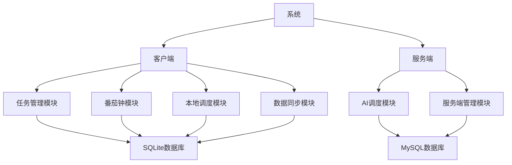
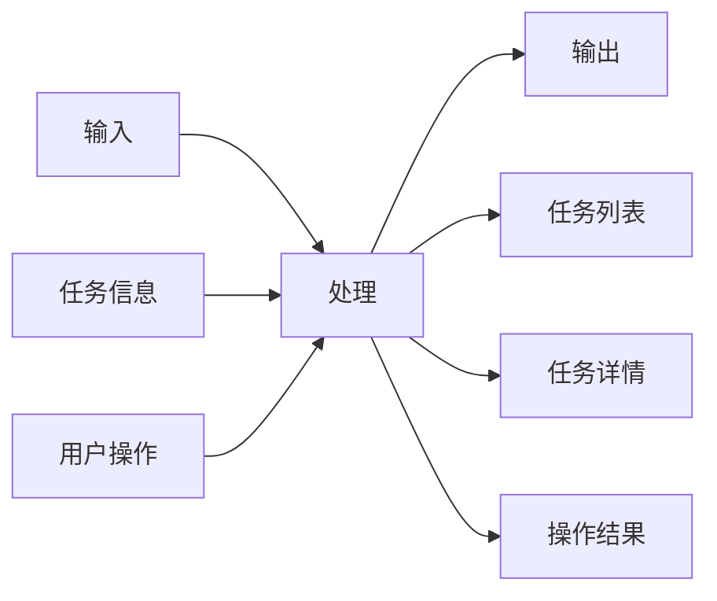
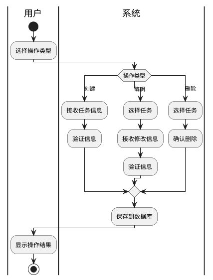
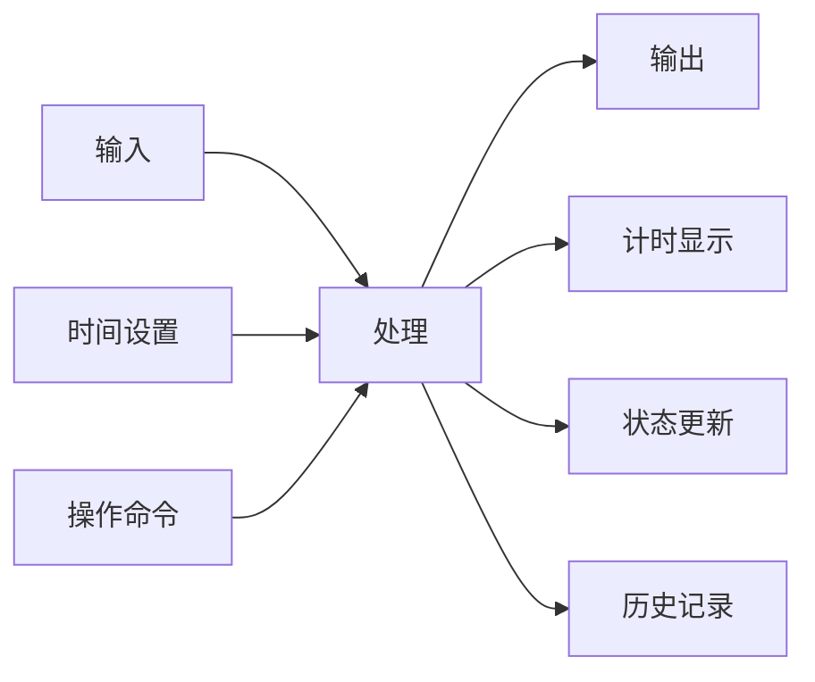
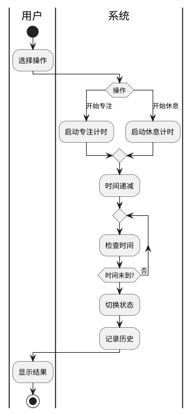
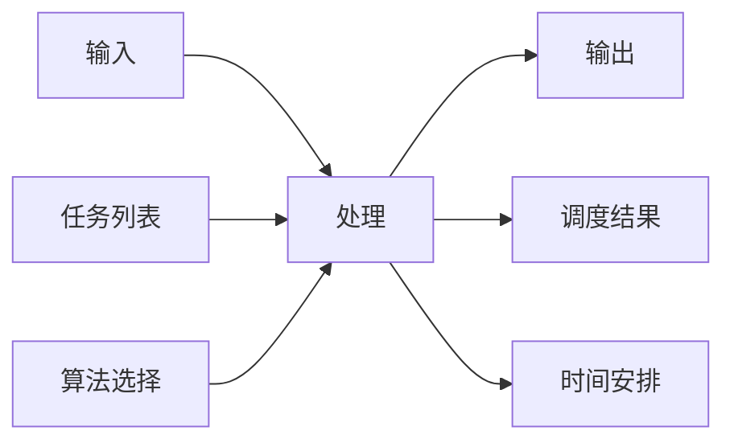
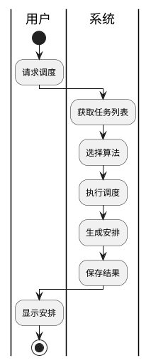
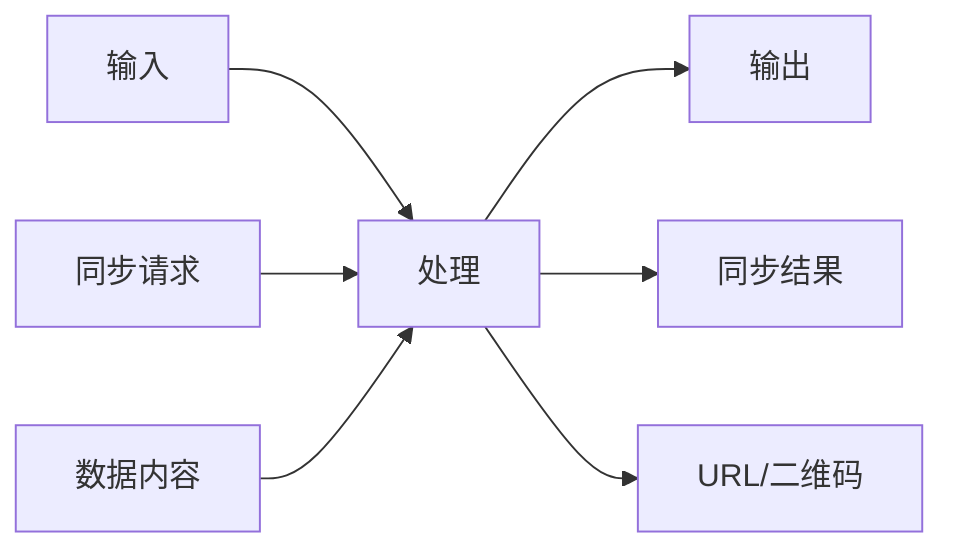
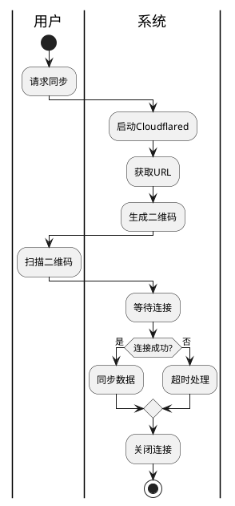

# 引言

## 编写目的
本文档旨在详细描述任务调度系统（TaskSchedule）的详细设计，为开发团队提供清晰的实现指导。通过本文档，开发团队可以了解系统的具体实现细节、模块设计和接口规范。

## 背景
1. 系统名称：基于调度算法的智能时间管理优化系统（TaskSchedule）
2. 任务提出者：个人开发者
3. 开发者：个人开发者
4. 用户：需要智能时间管理的个人用户
5. 运行环境：Windows/macOS/Linux客户端，可选Linux服务端

## 定义
- 任务调度：根据特定算法自动安排任务执行时间的过程
- 优先级区间：将数字优先级划分为若干区间，用于简化用户选择
- 番茄钟：一种时间管理方法，将工作时间分为专注时间和休息时间
- Cloudflared：用于建立安全隧道的工具，用于数据同步

# 程序系统的结构

# 任务管理模块设计说明

## 程序描述
任务管理模块是系统的核心模块，负责任务的创建、编辑、删除和查询。该模块是常驻内存的，采用顺序处理方式。

## 功能

## 输入项
1. 任务基本信息
   - 名称：字符串，长度限制100字符
   - 描述：字符串，长度限制500字符
   - 优先级：整数，范围0-5000
   - 标签：字符串数组，每个标签长度限制20字符

2. 任务时间信息
   - 开始时间：datetime格式
   - 结束时间：datetime格式
   - 预计完成时间：整数，单位分钟
   - 休息时间：整数，单位分钟

3. 复杂任务信息
   - 周期类型：字符串，可选值：null/independent/composite
   - 完成次数：整数或字符串（unlimited）
   - 时间段：time格式

## 输出项
1. 任务列表
   - 格式：JSON数组
   - 包含：任务ID、名称、优先级、状态等基本信息

2. 任务详情
   - 格式：JSON对象
   - 包含：任务所有信息

3. 操作结果
   - 格式：JSON对象
   - 包含：操作状态、错误信息等

## 算法
1. 优先级分配算法
   - 输入：用户选择的优先级区间或相对优先级
   - 处理：
     1. 根据配置确定优先级区间范围
     2. 计算具体优先级数值
     3. 确保优先级不重复
   - 输出：具体优先级数值

## 流程逻辑

## 接口
1. 数据库接口
   - 表名：tasks
   - 操作：CRUD
   - 关联：task_tags表

2. 用户界面接口
   - 输入：表单数据
   - 输出：JSON响应
   - 方法：RESTful API

# 番茄钟模块设计说明

## 程序描述
番茄钟模块用于辅助用户进行时间管理，通过定时器实现专注时间和休息时间的切换。该模块是常驻内存的，支持并发处理。

## 功能

## 输入项
1. 时间设置
   - 专注时长：整数，默认25分钟
   - 休息时长：整数，默认5分钟

2. 操作命令
   - 开始专注
   - 开始休息
   - 延长时间
   - 结束计时

## 输出项
1. 计时显示
   - 格式：字符串（MM:SS）
   - 更新频率：1秒

2. 状态更新
   - 格式：JSON对象
   - 包含：当前状态、剩余时间等

3. 历史记录
   - 格式：JSON数组
   - 包含：每次专注的详细信息

## 算法
1. 时间计算算法
   - 输入：设置的时间（分钟）
   - 处理：
     1. 转换为秒数
     2. 每秒递减
     3. 到达0时触发状态切换
   - 输出：剩余时间

## 流程逻辑

# 本地调度模块设计说明

## 程序描述
本地调度模块负责根据选定的算法自动安排任务执行时间。该模块是常驻内存的，采用顺序处理方式。

## 功能

## 输入项
1. 任务列表
   - 格式：JSON数组
   - 包含：所有待调度任务

2. 算法选择
   - 类型：字符串
   - 可选值：fcfs/sjf/rr/priority/custom

## 输出项
1. 调度结果
   - 格式：JSON对象
   - 包含：任务ID、安排时间等

2. 时间安排
   - 格式：JSON数组
   - 包含：每日任务安排

## 算法
1. 先来先服务（FCFS）
   - 按任务创建时间排序
   - 依次安排时间

2. 短任务优先（SJF）
   - 按预计完成时间排序
   - 优先安排短任务

3. 时间片轮转（RR）
   - 设置时间片大小
   - 循环分配时间片

4. 优先级调度
   - 按优先级排序
   - 优先安排高优先级任务

## 流程逻辑

# 数据同步模块设计说明

## 程序描述
数据同步模块负责在多设备间同步任务数据，使用Cloudflared建立安全隧道。该模块是常驻内存的，支持并发处理。

## 功能

## 输入项
1. 同步请求
   - 方向：client_to_mobile/mobile_to_client
   - 数据类型：tasks/pomodoros

2. 数据内容
   - 格式：JSON对象
   - 包含：需要同步的数据

## 输出项
1. 同步结果
   - 格式：JSON对象
   - 包含：同步状态、错误信息等

2. URL/二维码
   - URL：字符串
   - 二维码：图片数据

## 算法
1. Cloudflared调用算法
   - 输入：本地端口
   - 处理：
     1. 调用cloudflared命令
     2. 获取输出URL
     3. 生成二维码
   - 输出：URL和二维码

## 流程逻辑

# 存储分配

## 客户端
1. SQLite数据库
   - 位置：用户数据目录
   - 大小：根据使用情况动态增长
   - 备份：自动定期备份

2. 配置文件
   - 格式：YAML
   - 位置：用户配置目录
   - 大小：固定大小

## 服务端
1. MySQL数据库
   - 位置：服务器数据目录
   - 大小：根据使用情况动态增长
   - 备份：自动定期备份

# 注释设计

1. 模块注释
   - 文件头部：模块名称、功能描述、作者、日期
   - 函数头部：功能描述、参数说明、返回值说明

2. 关键代码注释
   - 算法实现：步骤说明、变量含义
   - 复杂逻辑：流程图说明
   - 特殊处理：原因说明

3. 调试注释
   - 临时调试代码：标记为待删除
   - 性能优化：标记优化点

# 限制条件

1. 系统限制
   - 操作系统：Windows 10/11, macOS 10.15+, Linux
   - Python版本：3.8+
   - 数据库：SQLite 3.x, MySQL 5.7+

2. 性能限制
   - 最大任务数：10000
   - 最大标签数：1000
   - 最大历史记录：100000

3. 安全限制
   - 数据同步：必须使用Cloudflared
   - 文件访问：限制在用户目录
   - 网络访问：限制必要端口

# 测试计划

1. 单元测试
   - 测试对象：各模块核心功能
   - 测试方法：自动化测试
   - 覆盖率要求：>80%

2. 集成测试
   - 测试对象：模块间交互
   - 测试方法：场景测试
   - 覆盖率要求：>90%

3. 性能测试
   - 测试对象：系统响应时间
   - 测试方法：压力测试
   - 指标要求：<1s

# 尚未解决的问题

1. AI调度模块的具体实现方案
2. 多设备同步时的冲突解决策略
3. 大规模数据下的性能优化方案 