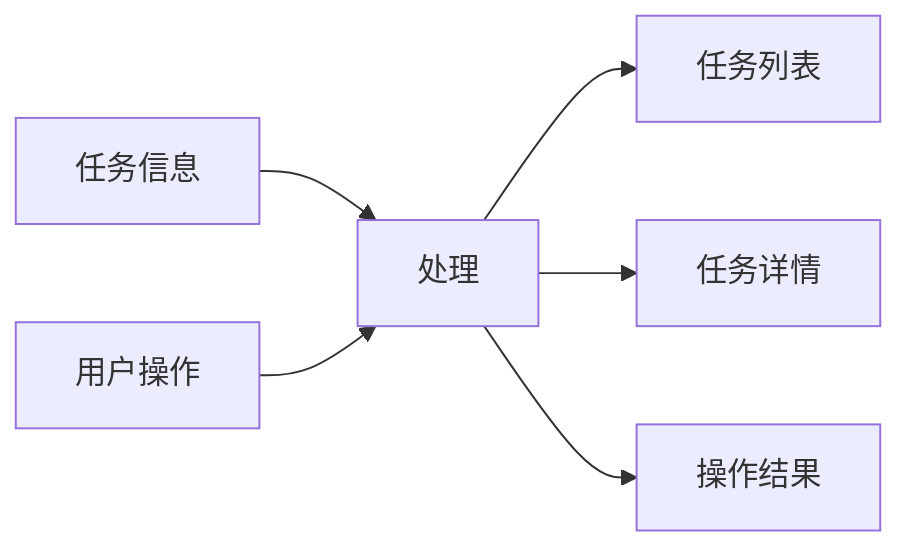

# 引言

## 编写目的
本文档旨在详细描述任务调度系统（TaskSchedule）的详细设计，为开发团队提供清晰的实现指导。通过本文档，开发团队可以了解系统的具体实现细节、模块设计和接口规范。

## 背景
1. 系统名称：基于调度算法的智能时间管理优化系统（TaskSchedule）
2. 任务提出者：个人开发者
3. 开发者：个人开发者
4. 用户：需要智能时间管理的个人用户
5. 运行环境：Windows/macOS/Linux客户端，可选Linux服务端

## 定义
- 任务调度：根据特定算法自动安排任务执行时间的过程
- 优先级区间：将数字优先级划分为若干区间，用于简化用户选择
- 番茄钟：一种时间管理方法，将工作时间分为专注时间和休息时间
- Cloudflared：用于建立安全隧道的工具，用于数据同步

# 程序系统的结构

# 任务管理模块设计说明

## 程序描述
任务管理模块是系统的核心模块，负责任务的创建、编辑、删除和查询。该模块是常驻内存的，采用顺序处理方式。

## 功能

## 输入项
1. 任务基本信息
   - 名称：字符串，长度限制100字符
   - 描述：字符串，长度限制500字符
   - 优先级：整数，范围0-5000
   - 标签：字符串数组，每个标签长度限制20字符

2. 任务时间信息
   - 开始时间：datetime格式
   - 结束时间：datetime格式
   - 预计完成时间：整数，单位分钟
   - 休息时间：整数，单位分钟

3. 复杂任务信息
   - 周期类型：字符串，可选值：null/independent/composite
   - 完成次数：整数或字符串（unlimited）
   - 时间段：time格式

## 输出项
1. 任务列表
   - 格式：JSON数组
   - 包含：任务ID、名称、优先级、状态等基本信息

2. 任务详情
   - 格式：JSON对象
   - 包含：任务所有信息

3. 操作结果
   - 格式：JSON对象
   - 包含：操作状态、错误信息等

## 算法
1. 优先级分配算法
   - 输入：用户选择的优先级区间或相对优先级
   - 处理：
     1. 根据配置确定优先级区间范围
     2. 计算具体优先级数值
     3. 确保优先级不重复
   - 输出：具体优先级数值

## 流程逻辑

## 接口
1. 数据库接口
   - 表名：tasks
   - 操作：CRUD
   - 关联：task_tags表

2. 用户界面接口
   - 输入：表单数据
   - 输出：JSON响应
   - 方法：RESTful API

# 番茄钟模块设计说明

## 程序描述
番茄钟模块用于辅助用户进行时间管理，通过定时器实现专注时间和休息时间的切换。该模块是常驻内存的，支持并发处理。

## 功能

## 输入项
1. 时间设置
   - 专注时长：整数，默认25分钟
   - 休息时长：整数，默认5分钟

2. 操作命令
   - 开始专注
   - 开始休息
   - 延长时间
   - 结束计时

## 输出项
1. 计时显示
   - 格式：字符串（MM:SS）
   - 更新频率：1秒

2. 状态更新
   - 格式：JSON对象
   - 包含：当前状态、剩余时间等

3. 历史记录
   - 格式：JSON数组
   - 包含：每次专注的详细信息

## 算法
1. 时间计算算法
   - 输入：设置的时间（分钟）
   - 处理：
     1. 转换为秒数
     2. 每秒递减
     3. 到达0时触发状态切换
   - 输出：剩余时间

## 流程逻辑

# 本地调度模块设计说明

## 程序描述
本地调度模块负责根据选定的算法自动安排任务执行时间。该模块是常驻内存的，采用顺序处理方式。

## 功能

## 输入项
1. 任务列表
   - 格式：JSON数组
   - 包含：所有待调度任务

2. 算法选择
   - 类型：字符串
   - 可选值：fcfs/sjf/rr/priority/custom

## 输出项
1. 调度结果
   - 格式：JSON对象
   - 包含：任务ID、安排时间等

2. 时间安排
   - 格式：JSON数组
   - 包含：每日任务安排

## 算法
1. 先来先服务（FCFS）
   - 按任务创建时间排序
   - 依次安排时间

2. 短任务优先（SJF）
   - 按预计完成时间排序
   - 优先安排短任务

3. 时间片轮转（RR）
   - 设置时间片大小
   - 循环分配时间片

4. 优先级调度
   - 按优先级排序
   - 优先安排高优先级任务

## 流程逻辑

# 数据同步模块设计说明

## 程序描述
数据同步模块负责在多设备间同步任务数据，使用Cloudflared建立安全隧道。该模块是常驻内存的，支持并发处理。

## 功能

## 输入项
1. 同步请求
   - 方向：client_to_mobile/mobile_to_client
   - 数据类型：tasks/pomodoros

2. 数据内容
   - 格式：JSON对象
   - 包含：需要同步的数据

## 输出项
1. 同步结果
   - 格式：JSON对象
   - 包含：同步状态、错误信息等

2. URL/二维码
   - URL：字符串
   - 二维码：图片数据

## 算法
1. Cloudflared调用算法
   - 输入：本地端口
   - 处理：
     1. 调用cloudflared命令
     2. 获取输出URL
     3. 生成二维码
   - 输出：URL和二维码

## 流程逻辑

# 存储分配

## 客户端
1. SQLite数据库
   - 位置：用户数据目录
   - 大小：根据使用情况动态增长
   - 备份：自动定期备份

2. 配置文件
   - 格式：YAML
   - 位置：用户配置目录
   - 大小：固定大小

## 服务端
1. MySQL数据库
   - 位置：服务器数据目录
   - 大小：根据使用情况动态增长
   - 备份：自动定期备份

# 注释设计

1. 模块注释
   - 文件头部：模块名称、功能描述、作者、日期
   - 函数头部：功能描述、参数说明、返回值说明

2. 关键代码注释
   - 算法实现：步骤说明、变量含义
   - 复杂逻辑：流程图说明
   - 特殊处理：原因说明

3. 调试注释
   - 临时调试代码：标记为待删除
   - 性能优化：标记优化点

# 限制条件

1. 系统限制
   - 操作系统：Windows 10/11, macOS 10.15+, Linux
   - Python版本：3.8+
   - 数据库：SQLite 3.x, MySQL 5.7+

2. 性能限制
   - 最大任务数：10000
   - 最大标签数：1000
   - 最大历史记录：100000

3. 安全限制
   - 数据同步：必须使用Cloudflared
   - 文件访问：限制在用户目录
   - 网络访问：限制必要端口

# 测试计划

1. 单元测试
   - 测试对象：各模块核心功能
   - 测试方法：自动化测试
   - 覆盖率要求：>80%

2. 集成测试
   - 测试对象：模块间交互
   - 测试方法：场景测试
   - 覆盖率要求：>90%

3. 性能测试
   - 测试对象：系统响应时间
   - 测试方法：压力测试
   - 指标要求：<1s

# 尚未解决的问题

1. AI调度模块的具体实现方案
2. 多设备同步时的冲突解决策略
3. 大规模数据下的性能优化方案 

# 详细设计说明书

**题目：** 基于调度算法的智能时间管理优化系统（TaskSchedule）详细设计

**学院：** 计算机科学与技术学院  
**专业：** 软件工程  
**学号：** 2021b11013  
**学生姓名：** 王易杰  
**指导教师：**  
**提交日期：** 年 月 日  

---

## 目录

1. 引言
   1.1 编写目的
   1.2 背景
   1.3 定义
   1.4 参考资料

2. 程序系统的结构

3. 任务管理模块设计说明
   3.1 程序描述
   3.2 功能
   3.3 性能
   3.4 输入项
   3.5 输出项
   3.6 算法
   3.7 流程逻辑
   3.8 接口
   3.9 存储分配
   3.10 注释设计
   3.11 限制条件
   3.12 测试计划
   3.13 尚未解决的问题

4. 番茄钟模块设计说明
   4.1 程序描述
   4.2 功能
   4.3 性能
   4.4 输入项
   4.5 输出项
   4.6 算法
   4.7 流程逻辑
   4.8 接口
   4.9 存储分配
   4.10 注释设计
   4.11 限制条件
   4.12 测试计划
   4.13 尚未解决的问题

5. 本地调度模块设计说明
   5.1 程序描述
   5.2 功能
   5.3 性能
   5.4 输入项
   5.5 输出项
   5.6 算法
   5.7 流程逻辑
   5.8 接口
   5.9 存储分配
   5.10 注释设计
   5.11 限制条件
   5.12 测试计划
   5.13 尚未解决的问题

6. 数据同步模块设计说明
   6.1 程序描述
   6.2 功能
   6.3 性能
   6.4 输入项
   6.5 输出项
   6.6 算法
   6.7 流程逻辑
   6.8 接口
   6.9 存储分配
   6.10 注释设计
   6.11 限制条件
   6.12 测试计划
   6.13 尚未解决的问题

---

## 1. 引言

### 1.1 编写目的
本文档旨在详细描述任务调度系统的设计实现，为开发团队提供清晰的实现指导。

### 1.2 背景
- 系统名称：基于调度算法的智能时间管理优化系统（TaskSchedule）
- 任务提出者：个人开发者
- 开发者：个人开发者
- 用户：需要智能时间管理的个人用户
- 运行环境：Windows/macOS/Linux客户端，可选Linux服务端

### 1.3 定义
- 任务调度：根据特定算法自动安排任务执行时间的过程
- 优先级区间：将数字优先级划分为若干区间，用于简化用户选择
- 番茄钟：一种时间管理方法，将工作时间分为专注时间和休息时间
- Cloudflared：用于建立安全隧道的工具，用于数据同步

### 1.4 参考资料
- 详细设计说明书（GB8567-88）
- 选题审批表
- 任务书
- 开题报告

---

## 2. 程序系统的结构

系统采用客户端-服务端架构：
- 客户端模块：
  - 任务管理模块
  - 番茄钟模块
  - 本地调度模块
  - 数据同步模块
- 服务端模块：
  - AI调度模块
  - 服务端管理模块

数据存储：
- 客户端使用SQLite数据库
- 服务端使用MySQL数据库

---

## 3. 任务管理模块设计说明

### 3.1 程序描述
负责任务的创建、编辑、删除和查询，采用顺序处理方式。

### 3.2 功能
- 接收任务信息
- 处理用户操作
- 输出任务列表、详情和操作结果

### 3.3 性能
- 响应时间：<0.5s
- 最大任务数：10000
- 最大标签数：1000

### 3.4 输入项
1. 任务基本信息：
   - 名称：字符串，≤100字符
   - 描述：字符串，≤500字符
   - 优先级：整数，0-5000
   - 标签：字符串数组，每个≤20字符

2. 任务时间信息：
   - 开始时间：datetime
   - 结束时间：datetime
   - 预计完成时间：分钟
   - 休息时间：分钟

### 3.5 输出项
1. 任务列表：
   - 格式：JSON数组
   - 内容：任务ID、名称、优先级、状态等

2. 任务详情：
   - 格式：JSON对象
   - 内容：完整任务信息

3. 操作结果：
   - 格式：JSON对象
   - 内容：状态、错误信息等

### 3.6 算法
优先级分配算法：
1. 根据用户选择的优先级区间确定范围
2. 计算具体数值
3. 确保优先级不重复

### 3.7 流程逻辑
1. 用户选择操作类型（创建/编辑/删除）
2. 系统接收并验证信息
3. 保存到数据库
4. 返回操作结果

### 3.8 接口
1. 数据库接口：
   - 表名：tasks
   - 操作：CRUD
   - 关联表：task_tags

2. 用户界面接口：
   - 输入：表单数据
   - 输出：JSON响应
   - 方法：RESTful API

### 3.9 存储分配
- SQLite数据库存储在用户数据目录
- 配置文件使用YAML格式

### 3.10 注释设计
- 模块头部注释：功能描述、作者、日期
- 函数注释：参数说明、返回值
- 关键算法注释：步骤说明

### 3.11 限制条件
- 操作系统：Windows 10+/macOS 10.15+/Linux
- Python版本：3.8+
- SQLite版本：3.x

### 3.12 测试计划
- 单元测试覆盖率>80%
- 集成测试覆盖率>90%
- 压力测试响应时间<1s

### 3.13 尚未解决的问题
- 大规模数据性能优化
- 多设备同步冲突解决

---

## 4. 番茄钟模块设计说明

### 4.1 程序描述
实现专注时间和休息时间的定时管理，支持并发处理。

### 4.2 功能
- 接收时间设置和操作命令
- 处理计时逻辑
- 输出计时显示和状态更新

### 4.3 性能
- 计时精度：1秒
- 最大历史记录：100000条

### 4.4 输入项
1. 时间设置：
   - 专注时长：分钟，默认25
   - 休息时长：分钟，默认5

2. 操作命令：
   - 开始专注
   - 开始休息
   - 结束计时

### 4.5 输出项
1. 计时显示：
   - 格式：MM:SS
   - 更新频率：1秒

2. 状态更新：
   - 格式：JSON对象
   - 内容：当前状态、剩余时间

### 4.6 算法
时间计算算法：
1. 将分钟转换为秒
2. 每秒递减
3. 到达0时切换状态

### 4.7 流程逻辑
1. 用户选择操作
2. 系统启动对应计时器
3. 时间递减循环
4. 时间到后切换状态

### 4.8 接口
- 数据库接口：存储历史记录
- UI接口：实时状态更新

### 4.9 存储分配
- 历史记录存储在SQLite
- 配置存储在YAML文件

### 4.10 注释设计
- 状态机转换注释
- 计时逻辑注释

### 4.11 限制条件
- 最小时间单位：1分钟
- 最大单次计时：240分钟

### 4.12 测试计划
- 计时准确性测试
- 并发操作测试

### 4.13 尚未解决的问题
- 打断处理机制优化

---

## 5. 本地调度模块设计说明

### 5.1 程序描述
根据选定算法自动安排任务执行时间。

### 5.2 功能
- 接收任务列表和算法选择
- 执行调度计算
- 输出时间安排

### 5.3 性能
- 调度计算时间：<1s（100任务内）
- 支持任务数：≤10000

### 5.4 输入项
1. 任务列表：
   - 格式：JSON数组
   - 内容：待调度任务集合

2. 算法选择：
   - 类型：字符串
   - 可选值：fcfs/sjf/priority等

### 5.5 输出项
1. 调度结果：
   - 格式：JSON对象
   - 内容：任务ID、安排时间

2. 每日安排：
   - 格式：JSON数组
   - 内容：时间分段任务分配

### 5.6 算法
1. FCFS：按创建时间排序
2. SJF：按预计时间排序
3. 优先级：按优先级排序

### 5.7 流程逻辑
1. 获取任务列表
2. 选择调度算法
3. 生成时间安排
4. 保存结果

### 5.8 接口
- 任务管理模块接口
- 日历展示接口

### 5.9 存储分配
- 调度结果存入SQLite
- 算法配置存YAML

### 5.10 注释设计
- 算法实现注释
- 边界条件注释

### 5.11 限制条件
- 最小时间粒度：15分钟
- 最大前瞻时间：30天

### 5.12 测试计划
- 算法正确性验证
- 负载压力测试

### 5.13 尚未解决的问题
- 动态调整策略

---

## 6. 数据同步模块设计说明

### 6.1 程序描述
实现多设备间数据同步，使用Cloudflared建立安全隧道。

### 6.2 功能
- 接收同步请求和数据
- 建立安全连接
- 完成数据同步

### 6.3 性能
- 同步延迟：<2s（局域网）
- 数据传输速率：≥1MB/s

### 6.4 输入项
1. 同步请求：
   - 方向：client_to_mobile等
   - 数据类型：tasks/pomodoros

2. 数据内容：
   - 格式：JSON对象
   - 内容：待同步数据

### 6.5 输出项
1. 同步结果：
   - 格式：JSON对象
   - 内容：状态、错误信息

2. 连接信息：
   - URL：字符串
   - 二维码：BASE64图片

### 6.6 算法
Cloudflared调用流程：
1. 启动本地端口监听
2. 调用cloudflared命令
3. 生成访问链接和二维码

### 6.7 流程逻辑
1. 发起同步请求
2. 建立安全连接
3. 传输数据
4. 验证一致性

### 6.8 接口
- Cloudflared命令行接口
- 二维码生成接口

### 6.9 存储分配
- 临时端口配置
- 同步日志存储

### 6.10 注释设计
- 安全协议注释
- 异常处理注释

### 6.11 限制条件
- 必须使用Cloudflared
- 网络端口限制

### 6.12 测试计划
- 跨平台同步测试
- 断点续传测试

### 6.13 尚未解决的问题
- 冲突解决策略
- 离线同步方案