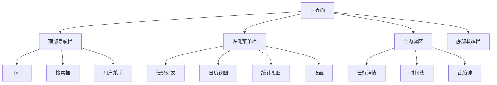

# 用户界面设计

## 1. 界面布局

### 1.1 主界面布局


### 1.2 组件设计
1. 任务卡片
```typescript
interface TaskCard {
  id: string;
  title: string;
  priority: number;
  status: TaskStatus;
  timeInfo: TimeInfo;
  tags: string[];
}
```

2. 时间线组件
```typescript
interface Timeline {
  date: Date;
  blocks: TimeBlock[];
  tasks: Task[];
}
```

3. 番茄钟组件
```typescript
interface PomodoroTimer {
  mode: 'focus' | 'break';
  timeLeft: number;
  totalTime: number;
  status: 'running' | 'paused' | 'stopped';
}
```

## 2. 交互设计

### 2.1 任务管理交互
1. 创建任务
   - 点击"新建任务"按钮
   - 填写任务表单
   - 设置优先级
   - 选择时间信息
   - 添加标签

2. 编辑任务
   - 双击任务卡片
   - 修改任务信息
   - 保存更改

3. 删除任务
   - 右键菜单选择删除
   - 确认删除操作

### 2.2 优先级设置交互
1. 区间选择
   - 拖动滑块选择区间
   - 显示区间范围
   - 确认选择

2. 相对优先级
   - 选择参考任务
   - 选择优先级关系
   - 自动计算新优先级

3. 直接设置
   - 输入具体数值
   - 验证数值范围
   - 确认设置

### 2.3 时间管理交互
1. 时间块操作
   - 拖拽调整时间
   - 双击编辑详情
   - 右键菜单操作

2. 番茄钟控制
   - 开始/暂停按钮
   - 重置按钮
   - 设置按钮

3. 日历视图
   - 月视图切换
   - 周视图切换
   - 日视图切换

## 3. 响应式设计

### 3.1 布局适配
1. 桌面端
   - 多列布局
   - 完整功能
   - 快捷键支持

2. 平板端
   - 双列布局
   - 核心功能
   - 触控优化

3. 移动端
   - 单列布局
   - 基础功能
   - 手势操作

### 3.2 主题设计
1. 浅色主题
   - 主色调：#FFFFFF
   - 强调色：#1976D2
   - 文字色：#333333

2. 深色主题
   - 主色调：#121212
   - 强调色：#90CAF9
   - 文字色：#FFFFFF

### 3.3 动画效果
1. 过渡动画
   - 页面切换
   - 状态变化
   - 数据更新

2. 交互反馈
   - 点击效果
   - 拖拽效果
   - 加载动画 