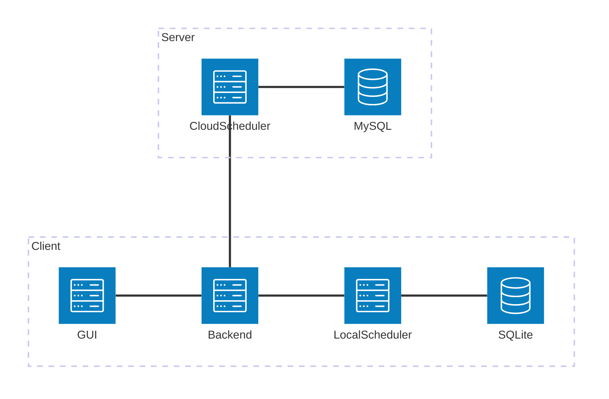

# 设计灵感
生活中的时间管理工具（Todolist）大多功能单一，仅限"记录"，并不会进行"管理"，也就是代替用户对某个或某些任务进行安排。而时间管理最大的问题就是"时间管理"这个行为本身相当浪费时间。
故此，我做出该设计，在任务列表的基础上设计这个系统，以CPU调度算法为基础设计任务调度工具，自动完成对任务的合理安排。

## 竞品简析
- 可以说毫无例外的，所有Todelist类（课程表，日程表等）工具，都不会主动对用户的任务加以安排。即使有，也大多是工业软件，没有产品化或不便于常规甚至于轻量级用户使用
- 完全没有例外的，所有有"优先级设置"功能的工具，优先级设计要么优先级档位少，不利于精细化设置，要么优先级档位多，不利于用户模糊选择，增加了决策和思考成本，不利于轻量级用户使用

## 创新点
1. 通过调度算法主动安排任务
2. 通过一套优先级选择算法，优化优先级选择的用户体验
3. 服务端额外部署服务器，接受所有（愿意使用的）用户的脱敏数据，训练（无画像的）通用AI调度（不一定会实现）

## 目标受众
- 轻量级用户，不想手动管理时间/不想要粗略的优先级划分
- 无编程经验用户，难以理解复杂的任务依赖关系、调度策略、数值机制

### 解决方案
（根本）精细数字优先级（保证精度）
+
（基础）模糊优先级区间选择（便于大致选择优先级）
+
（改进）比较式优先级选择（相对优先级，直观，符合日常逻辑）
+
（进阶）直接数值填写（究极精度，满足进阶用户）

# 核心功能
- 特色优先级选择机制
- 基于调度算法（轮转调度算法，短作业有限算法，先来先服务算法……）实现本地时间管理（简单说为每个任务安排具体执行的日期和时间段）

# 其余功能

## 客户端
1. SQLite数据库
2. 支持复杂任务信息的录入
    - 次数任务
    - 周期任务
    - ……
3. 时间管理小工具：
    - 番茄钟（辅助时间管理）
    - ……
4. 显示：
    - 任务列表（列表视图 + 月度视图）
    - 必要界面（任务调度，任务统计，任务管理CRUD，番茄钟，调度算法切换）
    - 任务反馈（满意度等）
    - ……
5. 可选的任务调度算法
    - 轮转调度、短作业优先、先来先服务……

## 服务端（作为可选功能/可选实现功能）
1. 智能时间管理算法（基于机器学习或强化学习的AI时间管理方案，不保留或使用用户信息）
2. 上传匿名数据，返回调度结果
3. 上传的匿名数据用于AI训练学习（参数包括满意度，任务调度后情况等）

# 任务数据结构

## 基本思路

- 任务基础信息
    - 任务ID（不可重复，不可空，自动生成）字面意思
    - 名称（可重复，可空）字面意思
    - 描述（可重复，可空）字面意思
    - 单次预计时间（可重复，可空，分钟，缺省值=30分钟）即完成 1 次任务所需的大致时间
    - 地点（可重复，可空）字面意思，前后地点不一致时加入更多通勤预算
        - 通勤时间（可重复，可空，缺省值）字面意思，手动设置
            - 缺省值 == (地点1 != 地点2 ? 30分钟 : 5分钟)

- 复杂任务支持(三维度)：
    1. 周期（非空）
        - 每个周期内各完成（比如，每三天，每一个月）
        - 起止时间内完成（即单个周期）
            - 开始时间（可空，缺省值=任务创建时间）
            - 结束书简（可空）为空则为无限制任务，完成全部次数即为完成
    2. 完成次数（非空）
        - 一次（n = 1）
        - n次
    3. 时间段（非空）
        - 任务有具体的时间点或时间段（即不可调度调整的任务）
        - 任务没有时间点或时间段要求（即可以调度调整的任务）

    - 对于复杂（复合）周期
        - 多周期混合（比如每周三和周五）可拆解为两个周期性任务，每周三+每周五

- 关键参数
    - 优先级（不可重复，不可空，算法生成）见述  优先级选择部分  内容

# 技术选型

## 方案比较
- 用户端
    - 前端
        1. HTML + CSS + JavaScript
            - 优点：
                - 技术栈简单，学习成本低
                - 无需构建工具，开发快速
                - 浏览器原生支持，兼容性好
            - 缺点：
                - 代码组织困难，维护成本高
                - 缺乏组件化支持
                - 状态管理复杂
                - 开发效率低
        2. Vue + Element + JavaScript
            - 优点：
                - 组件化开发，代码复用性高
                - 响应式数据管理
                - 丰富的UI组件库
                - 开发效率高
                - 社区活跃，文档完善
            - 缺点：
                - 需要构建工具
                - 项目体积较大
    - 后端
        1. Python
            - 优点：
                - 语法简洁，开发效率高
                - 丰富的第三方库支持
                - 适合快速原型开发
                - 异步编程支持好
                - 机器学习生态完善
            - 缺点：
                - 性能相对较低
                - 多线程支持有限
                - 类型系统较弱
        2. JavaSpringBoot
            - 优点：
                - 性能优秀
                - 类型安全
                - 企业级框架支持
                - 多线程支持好
                - 适合大型项目
            - 缺点：
                - 开发效率相对较低
                - 配置复杂
                - 启动时间较长
                - 内存占用较大
    - 数据库
        1. SQLite
            - 优点：
                - 零配置，无需服务器
                - 单文件存储，便于迁移
                - 适合本地应用
                - 轻量级，资源占用少
            - 缺点：
                - 并发性能有限
                - 不支持网络访问
                - 不适合大规模数据
        2. SQL server
            - 优点：
                - 企业级功能完善
                - 性能优秀
                - 安全性高
                - 支持复杂查询
            - 缺点：
                - 商业软件，成本高
                - 资源占用大
                - 配置复杂
        3. MySQL
            - 优点：
                - 开源免费
                - 性能优秀
                - 社区活跃
                - 文档完善
                - 支持多种存储引擎
            - 缺点：
                - 需要单独部署
                - 配置相对复杂
- 服务端
    - 服务
        - JavaSpringBoot
            - 优点：
                - 企业级框架支持
                - 性能优秀
                - 安全性高
                - 适合高并发场景
                - 微服务支持好
            - 缺点：
                - 开发效率相对较低
                - 资源占用大
        - Python
            - 优点：
                - 开发效率高
                - 适合数据处理
                - AI/ML生态完善
                - 异步支持好
            - 缺点：
                - 性能相对较低
                - 并发处理能力有限
                - 不适合计算密集型任务
    - 数据库
        1. SQLite
            - 优点：
                - 简单易用
                - 无需管理
                - 适合小型应用
            - 缺点：
                - 不适合分布式部署
                - 扩展性有限
        2. SQL server
            - 优点：
                - 企业级功能
                - 高可用性
                - 安全性好
            - 缺点：
                - 成本高
                - 资源需求大
        3. MySQL
            - 优点：
                - 开源免费
                - 性能优秀
                - 社区支持好
                - 适合分布式部署
            - 缺点：
                - 需要专业维护
                - 配置相对复杂

### 方案选择

基于项目需求和上述技术方案比较，做出如下选择：

1. 前端技术选择：Vue + Element + JavaScript
    - **选择理由**：
        1. 项目需要良好的用户体验和交互性，Vue的组件化开发模式更适合
        2. 需要快速开发迭代，Vue的开发效率优势明显
        3. Element Plus提供了丰富的UI组件，可以快速构建美观的界面

2. 后端技术选择：Python
    - **选择理由**：
        1. 项目需要快速原型开发和迭代，Python的开发效率优势明显
        2. 需要处理任务调度算法，Python的算法实现更简洁
        3. 未来可能需要AI调度功能，Python的机器学习生态完善
        4. 虽然性能相对较低，但考虑到本项目主要是本地应用，性能需求不高

3. 数据库选择：SQLite（本地）+ MySQL（云端）
    - **选择理由**：
        1. 本地应用需要轻量级数据库，SQLite的零配置特性非常适合
        2. 用户数据主要在本地存储，SQLite的单文件存储便于迁移和备份
        3. 云端服务需要支持多用户并发，MySQL的性能和扩展性更适合
        4. MySQL的开源特性降低了项目成本

4. 服务端技术选择：Java Spring Boot + Python
    - **选择理由**：
        1. 服务端需要处理高并发请求，Java Spring Boot的性能优势明显
        2. 企业级框架支持提供了更好的安全性和可维护性
        3. Python用于AI模型训练和数据处理，发挥其生态优势
        4. 两种语言的组合可以发挥各自优势，互补不足

### 最终方案选择
- 用户端
    - 前端 Vue + Element + JavaScript
    - 后端 Python + SQLite
- 服务端
    - Java Spring Boot + Python + MySQL

### 方案合理性论证

1. **技术栈完整性**
   - 前端：Vue + Element 提供了完整的UI解决方案
   - 后端：Python + FastAPI 提供了高效的API开发框架
   - 数据库：SQLite + MySQL 覆盖了本地和云端存储需求
   - 服务端：Java + Python 组合提供了完整的服务能力

2. **开发效率与维护成本平衡**
   - 选择了开发效率高的技术（Vue、Python）
   - 同时考虑了长期维护成本（类型系统、框架支持）
   - 技术栈成熟稳定，社区支持好

3. **性能与资源消耗平衡**
   - 本地应用使用轻量级技术（SQLite）
   - 服务端使用高性能技术（Java Spring Boot）
   - 合理分配计算资源

4. **扩展性考虑**
   - 前端组件化支持功能扩展
   - 后端微服务架构支持服务扩展
   - 数据库设计支持数据扩展

5. **开发者适配性**
   - 技术栈符合技术储备
   - 学习曲线适中
   - 文档和社区支持完善

# 设计部分

## 系统架构设计

用户操作客户端前端，客户端前端连接客户端后端，后端进行SQLite数储和调度。后端通过API访问服务端服务，服务端进行AI调度及MySQl存储。

（以下是mermaid的架构图，符合最新语法）

## 优先级选择算法
初步设计

### 基本思路

#### 思路
- 系统：
    1. 划分若干数字优先级（精细数值，任意数量至少有个几千）
    2. 将若干优先级划分为若干区间（远小于数字优先级数量，50倍以上），作为大致优先级选择（模糊选择）
    - 区间、区间范围以及数字优先级数量可配置，不影响底层逻辑。
- 用户：
    -  选择优先级
        - 方法一：直接选择大致优先级
        - 方法二：使用比较级，“比xxx任务优先/不优先”
            - 更加优先则为最近的更大的未被使用的数字
            - 更不优先则为最近的更小的违背使用的数字
            - 不考虑step大小
        - 方法三：直接设置哦具体数字优先级

#### 特点
1. 优先级本质：仅作为纯数值用于任务排序，无物理空间或索引含义。
2. 用户层抽象：在数值之上构建模糊区间选择和比较式优先级机制，降低用户操作复杂度。

#### 示例（仅是示例）
1. 系统：
    1. 划分数字优先级3000档（非数据结构，纯数字用于比较）
    2. 划分大致优先级三档，低、中、高
    3. 低档分配数字优先级0~1000，中档分配数字优先级1001~2000，高档分配数字优先级2001~3000
    4. 设置优先级step，step大小远小于数字优先级，50倍左右。如若数字优先级右边3000档则step为60左右。（用于之后留空间插入相对任务）

2. 用户（在系统设定后）：
    - 方法1: 选择大致优先级区间，低/中/高。按照先创建的优先级更高的原则，从  该档最高优先级 - step  的位置开始排序。(保证比较式优先级有空可插)
        - 比如上述条件下第一个任务选择 中 优先级区间，则优先级为 1000-60  =940，第二个添加的任务为  940-60  =880。
    - 方法2：（已有其他任务的前提下）选择已有任务，选择”更高/更低“优先级。
        - 比如已有任务优先级2000，选择该2000优先级任务，选择更高，则本任务优先级为2001，下一个任务更高则为2002，若2002已占则为2003
    - 方法3： 直接输入优先级数字，不可重复
        - 比如直接输入2345作为优先级