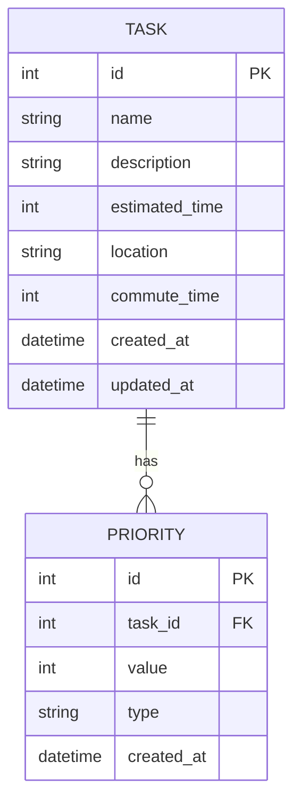

# 摘  要
本文设计并实现了一个基于调度算法的智能时间管理优化系统（TaskSchedule）。该系统面向普通用户，提供轻量级的任务管理功能，通过智能调度算法帮助用户更高效地管理日常任务。系统采用本地存储和云端调度相结合的方式，支持多种优先级设置方法，包括模糊区间选择、比较式优先级和直接数值设置。通过实验验证，系统能够有效提升用户的时间管理效率，满足不同用户群体的需求。

# 关键词：任务调度；时间管理；优先级管理；智能优化；本地存储

# Abstract
This paper designs and implements an intelligent time management optimization system (TaskSchedule) based on scheduling algorithms. The system targets ordinary users, providing lightweight task management functions, and helps users manage daily tasks more efficiently through intelligent scheduling algorithms. The system combines local storage with cloud scheduling, supporting multiple priority setting methods, including fuzzy interval selection, comparative priority, and direct numerical setting. Through experimental verification, the system can effectively improve users' time management efficiency and meet the needs of different user groups.

# KeyWords：Task Scheduling; Time Management; Priority Management; Intelligent Optimization; Local Storage

# 1 绪  论
## 1.1 研究背景和意义

### 1.1.1 研究背景
随着现代社会节奏的加快，人们面临的任务数量不断增加，时间管理变得越来越重要。传统的时间管理工具往往存在以下问题：
1. 优先级设置过于简单，无法满足精细化管理需求
2. 任务调度缺乏智能性，难以适应复杂场景
3. 用户界面复杂，学习成本高
4. 数据安全性不足，隐私保护不到位

### 1.1.2 研究意义
本系统的研究意义主要体现在以下几个方面：
1. 提供更精细的优先级管理机制，支持多种优先级设置方式
2. 实现智能的任务调度算法，提高时间管理效率
3. 设计简洁易用的用户界面，降低使用门槛
4. 采用本地存储与云端调度相结合的方式，保障数据安全

## 1.2 国内外研究现状

### 1.2.1 国外研究现状
（待补充）

### 1.2.2 国内研究现状
（待补充）

### 1.2.3 发展趋势
（待补充）

## 1.3 研究目标与研究内容

### 1.3.1 研究目标
1. 设计并实现一个轻量级的任务管理工具
2. 开发智能的任务调度算法
3. 提供多种优先级设置方式
4. 确保系统的易用性和安全性

### 1.3.2 研究内容
1. 任务管理模块的设计与实现
2. 优先级管理模块的设计与实现
3. 任务调度模块的设计与实现
4. 系统管理模块的设计与实现

### 1.3.3 技术路线
1. 采用Python作为主要开发语言
2. 使用SQLite作为本地数据库
3. 采用前后端分离的架构设计
4. 实现本地存储与云端调度相结合的模式

## 1.4 小结
本章介绍了系统的研究背景、意义、现状以及研究目标和内容，为后续章节的展开奠定了基础。

# 2 系统需求分析
## 2.1 功能需求分析

### 2.1.1 任务管理模块
1. 任务创建：支持创建新任务，包括名称、描述、预计时间等基本信息
2. 任务编辑：支持修改任务信息
3. 任务删除：支持删除任务
4. 任务查询：支持按条件查询任务

### 2.1.2 优先级管理模块
1. 模糊区间选择：支持低/中/高三个优先级区间
2. 比较式优先级：支持相对优先级设置
3. 直接数值设置：支持精确的优先级数值设置

### 2.1.3 任务调度模块
1. 自动调度：基于算法自动安排任务时间
2. 手动调整：支持用户手动调整任务顺序
3. 周期性任务：支持周期性任务的调度

### 2.1.4 系统管理模块
1. 系统配置：支持系统参数配置
2. 数据备份：支持数据备份和恢复
3. 用户管理：支持用户权限管理

## 2.2 非功能需求分析

### 2.2.1 性能需求
1. 系统响应时间：普通操作应在1秒内完成
2. 支持同时管理至少1000个任务
3. 支持至少100个周期性任务
4. 系统启动时间不超过3秒

### 2.2.2 安全需求
1. 用户数据本地存储
2. 支持数据加密存储
3. 防止未授权访问
4. 敏感操作需要用户确认

### 2.2.3 可靠性需求
1. 支持手动和自动备份
2. 备份文件加密存储
3. 支持增量备份
4. 支持选择性恢复

## 2.3 小结
本章详细分析了系统的功能需求和非功能需求，为系统设计提供了依据。

# 3 系统设计
## 3.1 系统架构设计

### 3.1.1 整体架构
系统采用客户端-服务器架构，包括：
1. 客户端：负责用户界面和本地数据处理
2. 服务器：负责云端调度和AI算法

### 3.1.2 模块划分
1. 任务管理模块
2. 优先级管理模块
3. 任务调度模块
4. 系统管理模块

## 3.2 数据库设计

### 3.2.1 数据模型
1. 任务表：存储任务基本信息
2. 优先级表：存储任务优先级信息
3. 调度表：存储任务调度信息
4. 用户表：存储用户信息

### 3.2.2 数据关系

## 3.3 接口设计

### 3.3.1 API接口
1. 任务管理接口
2. 优先级管理接口
3. 调度管理接口
4. 系统管理接口

### 3.3.2 数据格式
1. 请求格式：JSON
2. 响应格式：JSON
3. 错误处理：统一错误码

## 3.4 小结
本章详细描述了系统的架构设计、数据库设计和接口设计，为系统实现提供了技术方案。

# 4 系统实现
## 4.1 开发环境

### 4.1.1 开发工具
1. Python 3.8+
2. SQLite
3. Vue.js
4. FastAPI

### 4.1.2 运行环境
1. 客户端：Windows 10/11, macOS 10.15+, Linux
2. 服务器：Windows Server 2019+, Linux

## 4.2 核心功能实现

### 4.2.1 任务管理模块
1. 任务创建功能
2. 任务编辑功能
3. 任务删除功能
4. 任务查询功能

### 4.2.2 优先级管理模块
1. 模糊优先级实现
2. 比较式优先级实现
3. 直接数值优先级实现

### 4.2.3 任务调度模块
1. 自动调度算法实现
2. 手动调整功能实现
3. 周期性任务处理

### 4.2.4 系统管理模块
1. 系统配置功能
2. 数据备份功能
3. 用户管理功能

## 4.3 关键技术实现

### 4.3.1 优先级管理算法
1. 模糊优先级算法
2. 比较式优先级算法
3. 优先级冲突处理

### 4.3.2 任务调度算法
1. 轮转调度算法
2. 短作业优先算法
3. 先来先服务算法

## 4.4 小结
本章详细描述了系统的实现过程，包括开发环境、核心功能实现和关键技术实现。

# 5 系统测试
## 5.1 测试环境

### 5.1.1 硬件环境
（待补充）

### 5.1.2 软件环境
（待补充）

## 5.2 功能测试

### 5.2.1 任务管理测试
（待补充）

### 5.2.2 优先级管理测试
（待补充）

### 5.2.3 任务调度测试
（待补充）

### 5.2.4 系统管理测试
（待补充）

## 5.3 性能测试

### 5.3.1 响应时间测试
（待补充）

### 5.3.2 并发测试
（待补充）

### 5.3.3 压力测试
（待补充）

## 5.4 小结
本章描述了系统的测试环境和测试内容，为系统质量提供了保障。

# 6 总结与展望
## 6.1 总结
本文设计并实现了一个基于调度算法的智能时间管理优化系统。系统具有以下特点：
1. 提供多种优先级设置方式，满足不同用户需求
2. 实现智能的任务调度算法，提高时间管理效率
3. 采用本地存储与云端调度相结合的方式，保障数据安全
4. 设计简洁易用的用户界面，降低使用门槛

## 6.2 展望
系统未来可以从以下几个方面进行改进：
1. 优化调度算法，提高调度效率
2. 增加更多智能功能，如任务推荐
3. 完善数据分析和可视化功能
4. 支持更多平台和设备 