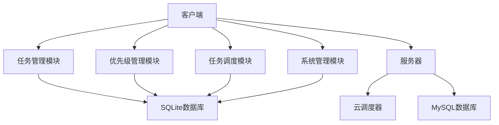
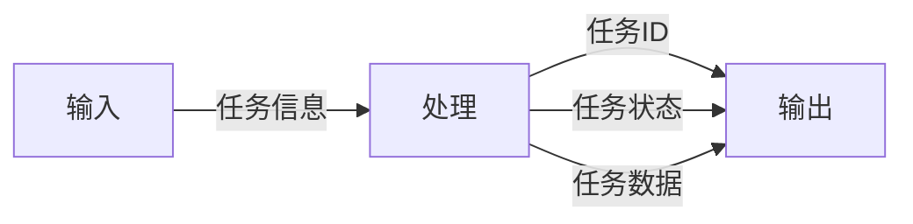
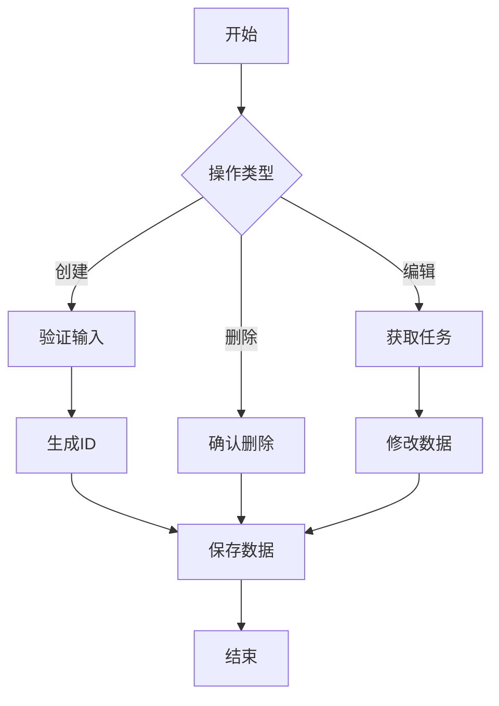
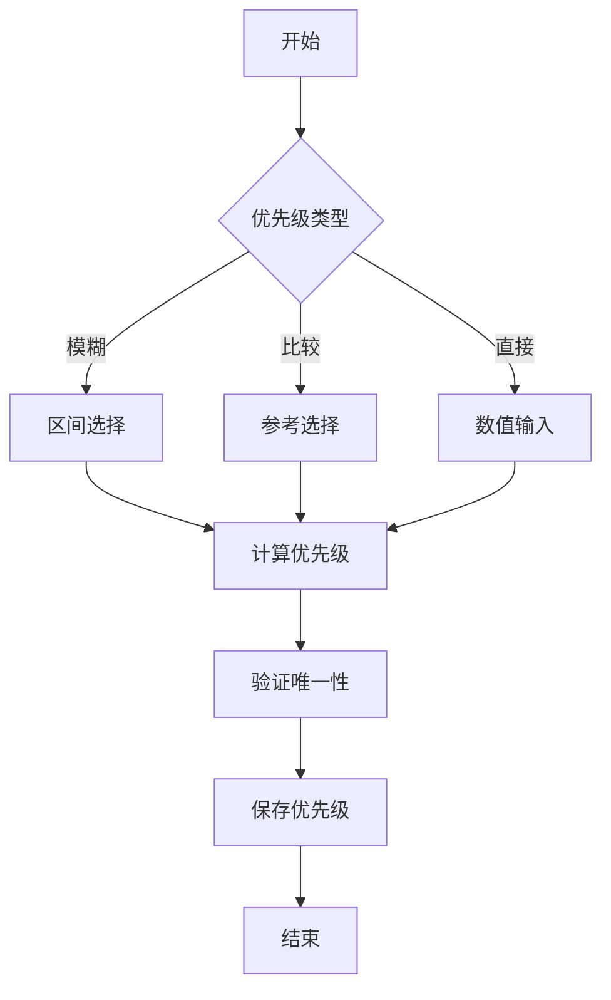
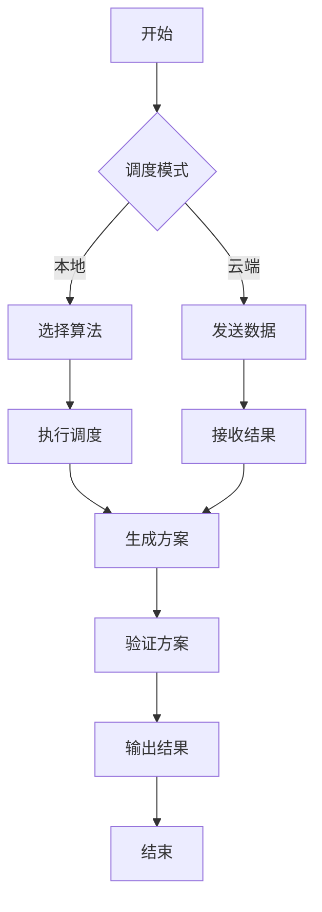
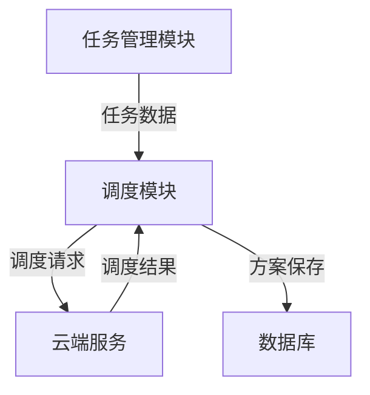
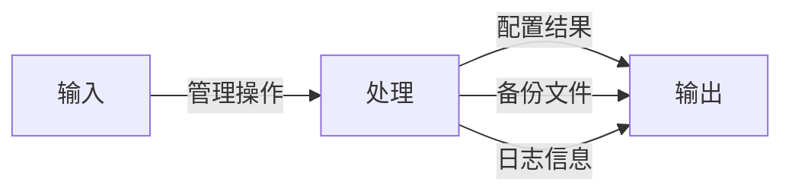
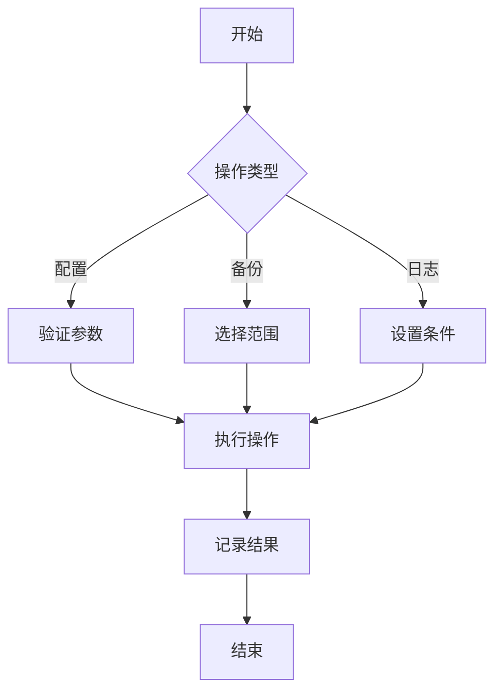
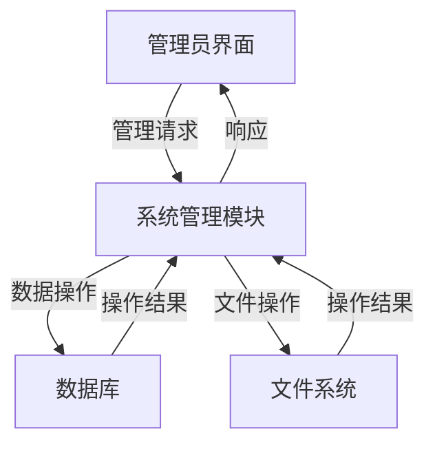

# 引言

## 编写目的
本文档旨在详细描述任务调度系统（TaskSchedule）的详细设计，为开发团队提供具体的技术实现指导。预期的读者包括系统设计人员、开发人员、测试人员和项目管理人员。

## 背景
1. 系统名称：基于调度算法的智能时间管理优化系统（TaskSchedule）
2. 任务提出者：项目需求方
3. 开发者：开发团队
4. 用户：需要智能时间管理的普通用户
5. 运行环境：Windows 10/11, macOS 10.15+, Linux

## 定义
- 调度算法：用于任务时间安排的算法，包括轮转调度、短作业优先、先来先服务等
- 优先级：任务的重要程度，用数字表示，数值越大优先级越高
- 通勤时间：任务地点变更时所需的时间预算
- 周期性任务：按固定周期重复执行的任务

# 程序系统的结构

# 任务管理模块设计说明

## 程序描述
任务管理模块是系统的核心组件之一，负责处理任务的创建、编辑、删除等基本操作。该模块常驻内存，支持并发处理，采用面向对象设计。

## 功能

## 性能
- 任务创建响应时间：<1秒
- 任务编辑响应时间：<1秒
- 任务删除响应时间：<1秒
- 支持同时管理1000+任务

## 输入项
1. 任务基本信息
   - 名称：字符串，长度1-100字符
   - 描述：字符串，长度0-500字符
   - 预计时间：整数，单位分钟，范围1-1440
   - 地点：字符串，长度0-100字符
   - 通勤时间：整数，单位分钟，范围0-120

2. 任务周期信息
   - 周期类型：枚举值（日/周/月）
   - 周期值：整数，范围1-365
   - 开始时间：日期时间
   - 结束时间：日期时间（可选）

## 输出项
1. 任务ID：整数，自动生成，唯一标识
2. 任务状态：枚举值（待完成/已完成/待跟进/已取消）
3. 时间情况：枚举值（未开始/进行中/已超时/已完成）
4. 任务数据：JSON格式，包含所有任务信息

## 算法
1. 任务ID生成算法
   - 使用UUID v4生成唯一标识符
   - 转换为整数作为任务ID

2. 任务状态判断算法
   - 根据当前时间与任务时间关系判断状态
   - 考虑周期性任务的特殊情况

## 流程逻辑

## 接口

## 存储分配
- 任务数据：SQLite数据库
- 缓存：内存缓存，LRU策略
- 临时数据：系统临时目录

## 注释设计
1. 模块注释：说明模块功能和主要接口
2. 类注释：说明类的职责和主要方法
3. 方法注释：说明方法的功能、参数和返回值
4. 关键算法注释：说明算法原理和实现细节

## 限制条件
1. 任务名称不能为空
2. 任务ID必须唯一
3. 预计时间必须在有效范围内
4. 周期性任务必须指定周期类型和值

## 测试计划
1. 单元测试
   - 测试任务创建功能
   - 测试任务编辑功能
   - 测试任务删除功能
   - 测试任务状态判断

2. 集成测试
   - 测试与数据库的交互
   - 测试与GUI层的交互
   - 测试与调度模块的交互

3. 性能测试
   - 测试大量任务的处理能力
   - 测试并发操作的处理能力

# 优先级管理模块设计说明

## 程序描述
优先级管理模块负责处理任务的优先级设置，支持多种优先级设置方式。该模块常驻内存，支持并发处理。

## 功能

## 性能
- 优先级设置响应时间：<1秒
- 支持3000档优先级
- 支持动态调整优先级

## 输入项
1. 模糊优先级
   - 类型：枚举值（低/中/高）
   - 参考任务：任务ID（可选）

2. 比较式优先级
   - 参考任务：任务ID
   - 关系：枚举值（更高/更低）

3. 直接数值
   - 优先级值：整数，范围0-3000

## 输出项
1. 优先级值：整数，范围0-3000
2. 优先级状态：布尔值，表示是否设置成功

## 算法
1. 模糊优先级算法
   - 低：0-1000
   - 中：1001-2000
   - 高：2001-3000

2. 比较式优先级算法
   - 更高：最近的更大未分配数值
   - 更低：最近的更小未分配数值

## 流程逻辑

## 接口

## 存储分配
- 优先级数据：SQLite数据库
- 缓存：内存缓存，LRU策略

## 注释设计
1. 模块注释：说明优先级管理策略
2. 类注释：说明优先级计算逻辑
3. 方法注释：说明优先级设置方法

## 限制条件
1. 优先级值必须唯一
2. 优先级值必须在有效范围内
3. 参考任务必须存在

## 测试计划
1. 单元测试
   - 测试模糊优先级设置
   - 测试比较式优先级设置
   - 测试直接数值设置

2. 集成测试
   - 测试与任务管理模块的交互
   - 测试与调度模块的交互

# 任务调度模块设计说明

## 程序描述
任务调度模块负责根据任务优先级和其他约束条件，生成最优的任务执行顺序。该模块支持本地调度和云端AI调度两种模式。

## 功能

## 性能
- 本地调度响应时间：<3秒
- 云端调度响应时间：<5秒
- 支持1000+任务的调度

## 输入项
1. 任务列表
   - 任务ID列表
   - 任务优先级
   - 任务时间约束
   - 任务地点信息

2. 调度参数
   - 调度算法选择
   - 时间范围
   - 优化目标

## 输出项
1. 调度方案
   - 任务执行顺序
   - 具体执行时间
   - 地点安排

2. 执行建议
   - 时间利用效率
   - 潜在冲突提示
   - 优化建议

## 算法
1. 轮转调度算法
   - 按优先级分组
   - 组内轮转执行

2. 短作业优先算法
   - 按预计时间排序
   - 优先执行短任务

3. 先来先服务算法
   - 按创建时间排序
   - 保持原始顺序

## 流程逻辑

## 接口

## 存储分配
- 调度方案：SQLite数据库
- 临时数据：内存缓存
- 云端数据：MySQL数据库

## 注释设计
1. 模块注释：说明调度策略
2. 类注释：说明算法实现
3. 方法注释：说明调度流程

## 限制条件
1. 任务必须满足时间约束
2. 地点变更需考虑通勤时间
3. 优先级必须有效

## 测试计划
1. 单元测试
   - 测试各调度算法
   - 测试约束处理
   - 测试优化目标

2. 集成测试
   - 测试与任务管理模块的交互
   - 测试与云端服务的交互

3. 性能测试
   - 测试大规模任务调度
   - 测试调度算法效率

# 系统管理模块设计说明

## 程序描述
系统管理模块负责系统的配置、备份和日志管理。该模块提供管理员所需的各种系统管理功能。

## 功能

## 性能
- 配置修改响应时间：<1秒
- 备份操作时间：<30秒
- 日志查询响应时间：<2秒

## 输入项
1. 系统配置
   - 参数名称
   - 参数值
   - 参数类型

2. 备份操作
   - 备份类型
   - 备份范围
   - 备份位置

3. 日志查询
   - 时间范围
   - 日志类型
   - 关键词

## 输出项
1. 配置结果
   - 成功/失败状态
   - 错误信息（如果有）

2. 备份文件
   - 备份文件路径
   - 备份文件大小
   - 备份时间

3. 日志信息
   - 日志条目列表
   - 日志统计信息

## 算法
1. 配置验证算法
   - 参数类型检查
   - 取值范围检查
   - 依赖关系检查

2. 备份算法
   - 增量备份
   - 加密存储
   - 压缩处理

## 流程逻辑

## 接口

## 存储分配
- 配置文件：JSON文件
- 备份文件：加密压缩文件
- 日志文件：文本文件

## 注释设计
1. 模块注释：说明管理功能
2. 类注释：说明操作方法
3. 方法注释：说明处理流程

## 限制条件
1. 仅管理员可访问
2. 敏感操作需要二次确认
3. 备份文件需要加密

## 测试计划
1. 单元测试
   - 测试配置修改
   - 测试备份操作
   - 测试日志查询

2. 集成测试
   - 测试与数据库的交互
   - 测试与文件系统的交互

3. 安全测试
   - 测试权限控制
   - 测试数据加密 