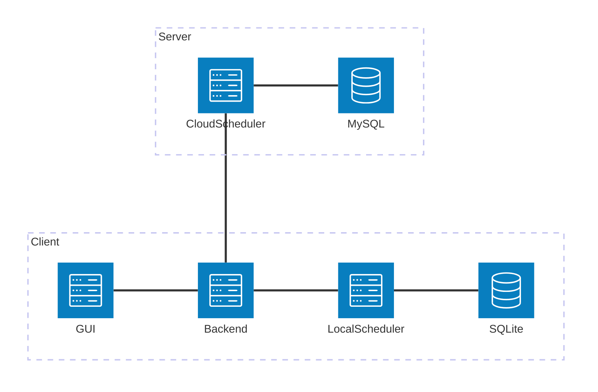
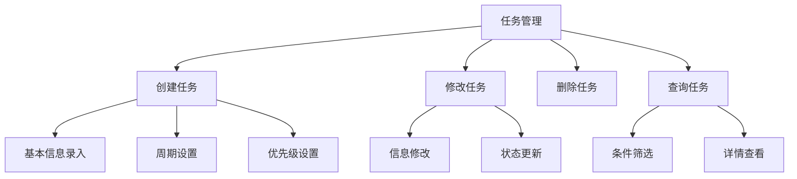
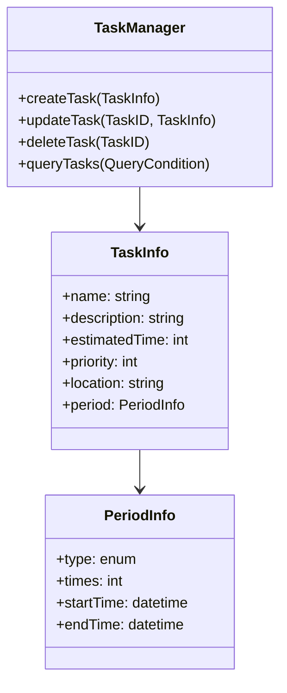
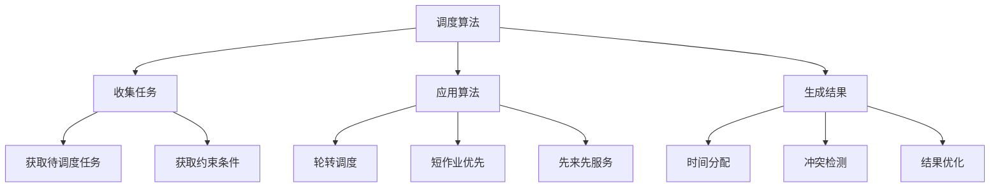
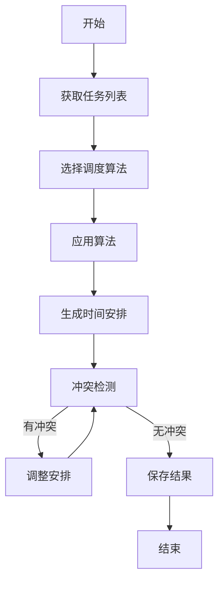
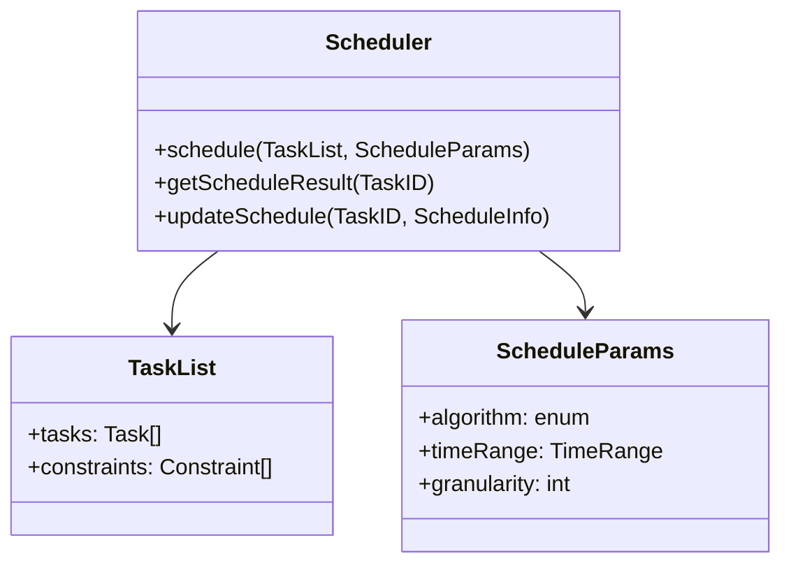
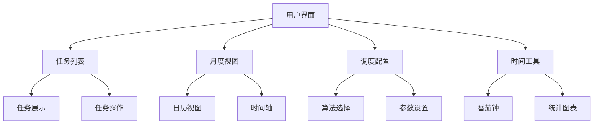
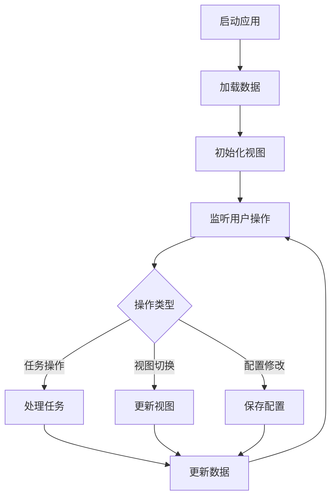
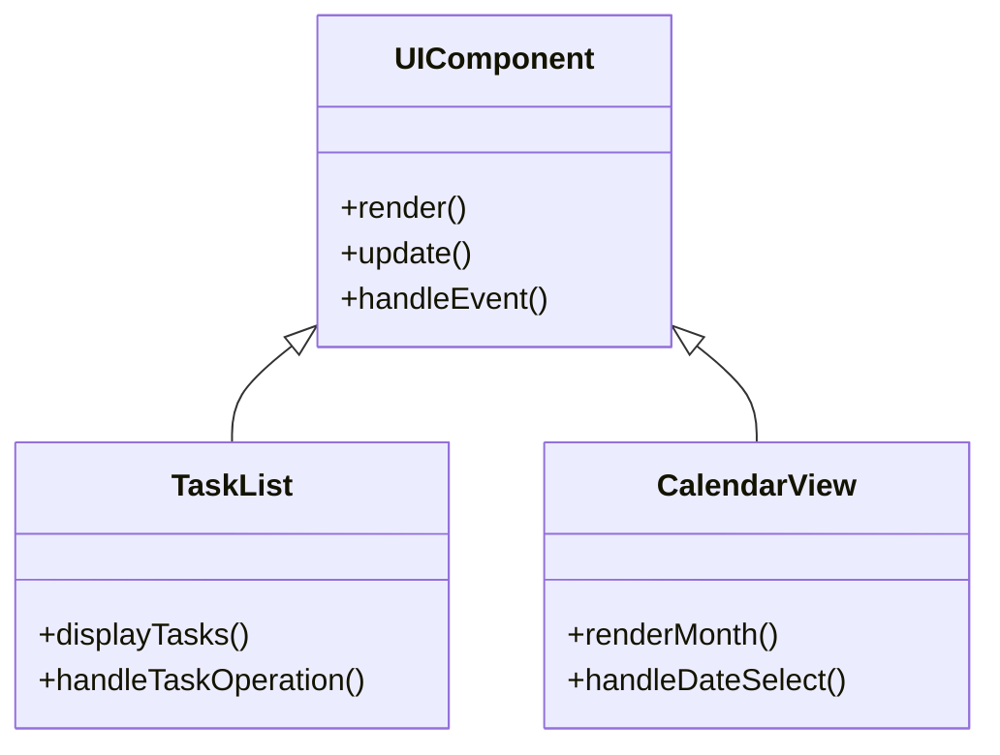

```mermaid
graph TD
    A[开始] --> B{选择优先级方式}
    B -->|模糊选择| C[选择区间]
    B -->|比较选择| D[选择参考任务]
    B -->|直接设置| E[输入具体值]
    
    C --> F[计算优先级]
    D --> F
    E --> F
    
    F --> G[验证优先级]
    G -->|有效| H[保存任务]
    G -->|无效| I[提示错误]
    H --> J[结束]
    I --> B
```

# 引言

## 编写目的

本文档旨在详细描述任务调度系统（TaskSchedule）的详细设计方案，为开发团队提供具体的技术实现指导。预期的读者包括开发人员、测试人员和项目管理者。

## 背景

1. 待开发软件系统的名称：TaskSchedule（任务调度系统）
2. 本项目的任务提出者：个人开发者
3. 开发者：个人开发者
4. 用户：需要智能时间管理的个人用户
5. 运行环境：Windows/macOS/Linux客户端，可选Linux服务端

## 定义

- 任务调度：基于CPU调度算法实现的任务时间安排
- 优先级选择算法：用于确定任务优先级的智能选择机制
- 本地调度器：运行在客户端的任务调度模块
- 云端调度器：运行在服务端的AI调度模块

# 程序系统的结构



# 任务管理模块设计说明

## 程序描述

任务管理模块是系统的核心组件，负责处理任务的创建、修改、删除和查询操作。该模块常驻内存，支持并发处理，采用面向对象设计。

## 功能



## 性能

## 输入项

1. 任务基本信息
   - 名称：字符串，最大长度100
   - 描述：文本，最大长度1000
   - 预计时间：整数，单位分钟
   - 地点：字符串，最大长度100

2. 任务周期信息
   - 周期类型：枚举值（日/周/月）
   - 完成次数：整数，最小值1
   - 开始时间：日期时间
   - 结束时间：日期时间（可选）

3. 优先级信息
   - 优先级区间：枚举值（低/中/高）
   - 参考任务ID：整数（可选）
   - 优先级关系：枚举值（更高/更低）（可选）
   - 具体优先级值：整数（可选，高级用户）

## 输出项

1. 任务列表
   - 任务ID：整数
   - 任务名称：字符串
   - 优先级：整数
   - 状态：枚举值
   - 预计时间：整数

2. 任务详情
   - 所有输入项信息
   - 创建时间：日期时间
   - 最后修改时间：日期时间
   - 调度结果：日期时间数组

## 算法

### 优先级选择算法

1. 系统配置
   - 数字优先级范围：0-3000
   - 优先级区间划分：
     - 低：0-1000
     - 中：1001-2000
     - 高：2001-3000
   - 优先级步长：60

2. 优先级分配规则
   - 模糊选择：从区间最高值开始，按步长递减
   - 比较选择：在参考任务优先级基础上±1
   - 直接设置：用户指定具体值

## 流程逻辑



## 接口



## 存储分配

- 任务表：SQLite数据库
  - 主键：task_id
  - 索引：priority, status, create_time
- 内存缓存：LRU缓存，最大1000条记录

## 注释设计

1. 模块注释
   ```python
   """
   任务管理模块
   负责处理任务的CRUD操作和优先级管理
   """
   ```

2. 类注释
   ```python
   """
   任务信息类
   包含任务的基本属性和周期信息
   """
   ```

3. 方法注释
   ```python
   """
   创建新任务
   @param task_info: 任务信息对象
   @return: 创建的任务ID
   """
   ```

## 限制条件

1. 任务数量限制：单个用户最多10000个任务
2. 优先级范围：0-3000
3. 并发访问：支持多用户并发操作
4. 数据一致性：使用事务保证数据一致性

## 测试计划

1. 单元测试
   - 任务创建测试
   - 优先级计算测试
   - 数据验证测试

2. 集成测试
   - 与调度器集成测试
   - 与数据库集成测试

3. 性能测试
   - 并发操作测试
   - 大数据量测试

## 尚未解决的问题

# 调度算法模块设计说明

## 程序描述

调度算法模块负责根据任务优先级和其他约束条件，自动安排任务的执行时间。该模块支持多种调度算法，可根据用户需求切换。

## 功能



## 性能

## 输入项

1. 任务列表
   - 任务ID：整数
   - 优先级：整数
   - 预计时间：整数
   - 约束条件：数组

2. 调度参数
   - 算法类型：枚举值
   - 时间范围：日期时间对
   - 时间粒度：整数（分钟）

## 输出项

1. 调度结果
   - 任务ID：整数
   - 开始时间：日期时间
   - 结束时间：日期时间
   - 执行状态：枚举值

## 算法

### 轮转调度算法

1. 按优先级排序任务
2. 为每个任务分配时间片
3. 循环执行直到所有任务完成

### 短作业优先算法

1. 按预计时间排序任务
2. 优先安排短时间任务
3. 考虑优先级作为次要因素

### 先来先服务算法

1. 按创建时间排序任务
2. 依次安排任务时间
3. 考虑优先级作为调整因素

## 流程逻辑



## 接口



## 存储分配

- 调度结果表：SQLite数据库
  - 主键：schedule_id
  - 外键：task_id
  - 索引：start_time, end_time

## 注释设计

1. 模块注释
   ```python
   """
   调度算法模块
   负责实现多种任务调度算法
   """
   ```

2. 算法注释
   ```python
   """
   轮转调度算法实现
   基于优先级的时间片轮转调度
   """
   ```

## 限制条件

1. 时间粒度：最小15分钟
2. 调度范围：最长30天
3. 任务数量：单次调度最多100个任务
4. 算法切换：支持运行时切换

## 测试计划

1. 算法测试
   - 各算法正确性测试
   - 边界条件测试

2. 性能测试
   - 大规模任务测试
   - 实时性测试

3. 集成测试
   - 与任务管理模块集成
   - 与用户界面集成

## 尚未解决的问题

# 用户界面模块设计说明

## 程序描述

用户界面模块提供系统的图形化操作界面，基于Vue.js和Element UI实现，支持响应式设计。

## 功能



## 性能

## 输入项

1. 用户操作
   - 鼠标点击
   - 键盘输入
   - 触摸操作（移动端）

2. 系统数据
   - 任务列表
   - 调度结果
   - 配置信息

## 输出项

1. 界面展示
   - 任务列表视图
   - 月度日历视图
   - 调度配置界面
   - 时间工具界面

2. 操作反馈
   - 成功提示
   - 错误提示
   - 确认对话框

## 算法

### 视图渲染算法

1. 列表视图
   - 按优先级排序
   - 分组显示
   - 虚拟滚动

2. 日历视图
   - 月历生成
   - 任务时间映射
   - 冲突高亮

## 流程逻辑



## 接口



## 存储分配

- 本地存储：localStorage
  - 用户配置
  - 界面状态
- 内存缓存：Vuex store
  - 任务数据
  - 视图状态

## 注释设计

1. 组件注释
   ```javascript
   /**
    * 任务列表组件
    * 负责显示和管理任务列表
    */
   ```

2. 方法注释
   ```javascript
   /**
    * 渲染任务列表
    * @param {Array} tasks 任务数组
    * @returns {void}
    */
   ```

## 限制条件

1. 浏览器兼容性：Chrome、Firefox、Safari最新版本
2. 屏幕尺寸：支持响应式设计，最小宽度320px
3. 性能要求：列表项超过1000时启用虚拟滚动
4. 动画性能：60fps流畅度

## 测试计划

1. 界面测试
   - 布局测试
   - 响应式测试
   - 动画测试

2. 交互测试
   - 用户操作测试
   - 数据同步测试
   - 错误处理测试

3. 性能测试
   - 渲染性能测试
   - 内存占用测试
   - 响应时间测试

## 尚未解决的问题
