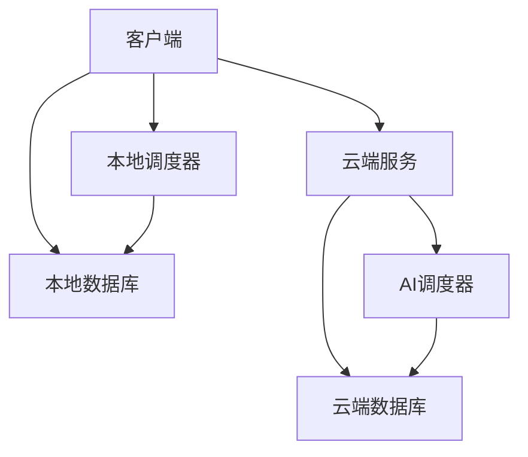

# 智能时间管理优化系统详细设计文档

## 1. 系统架构设计

### 1.1 整体架构


### 1.2 技术栈选择
- 前端：Vue3 + TypeScript + Element Plus
- 客户端后端：Python FastAPI
- 服务器端：Java Spring Boot
- 本地数据库：SQLite
- 云端数据库：MySQL
- AI框架：PyTorch/TensorFlow

## 2. 模块详细设计

### 2.1 任务管理模块

#### 2.1.1 任务数据结构
```typescript
interface Task {
    id: string;                    // 任务ID
    name: string;                  // 任务名称
    description?: string;          // 任务描述
    priority: number;              // 优先级
    startTime?: Date;              // 开始时间
    endTime?: Date;                // 结束时间
    status: TaskStatus;            // 任务状态
    timeStatus: TimeStatus;        // 时间状态
    type?: TaskType;               // 任务类型
    cycle?: TaskCycle;             // 任务周期
    count: number;                 // 任务计数
    isLocked: boolean;             // 是否锁定
    estimatedTime?: number;        // 预计时间（分钟）
    createTime: Date;              // 创建时间
    updateTime: Date;              // 更新时间
}

enum TaskStatus {
    PENDING = '待完成',
    COMPLETED = '已完成',
    FOLLOW_UP = '待跟进',
    CANCELLED = '已取消'
}

enum TimeStatus {
    NOT_STARTED = '未开始',
    IN_PROGRESS = '进行中',
    OVERDUE = '已超时',
    COMPLETED = '已完成'
}
```

#### 2.1.2 任务管理接口
```python
class TaskManager:
    def create_task(self, task: Task) -> Task
    def update_task(self, task_id: str, task: Task) -> Task
    def delete_task(self, task_id: str) -> bool
    def get_task(self, task_id: str) -> Task
    def list_tasks(self, filters: dict) -> List[Task]
    def update_task_status(self, task_id: str, status: TaskStatus) -> Task
```

### 2.2 调度算法模块

#### 2.2.1 调度算法接口
```python
class Scheduler:
    def schedule(self, tasks: List[Task]) -> List[ScheduledTask]
    def evaluate(self, tasks: List[Task]) -> ScheduleEvaluation

class RoundRobinScheduler(Scheduler):
    def __init__(self, time_slice: int):
        self.time_slice = time_slice

class ShortestJobFirstScheduler(Scheduler):
    def __init__(self):
        pass

class FirstComeFirstServeScheduler(Scheduler):
    def __init__(self):
        pass
```

#### 2.2.2 调度结果数据结构
```typescript
interface ScheduledTask {
    taskId: string;
    startTime: Date;
    endTime: Date;
    actualDuration: number;
}

interface ScheduleEvaluation {
    totalTime: number;
    averageWaitingTime: number;
    averageTurnaroundTime: number;
    efficiency: number;
}
```

### 2.3 AI调度模块

#### 2.3.1 模型设计
```python
class AIScheduler:
    def __init__(self):
        self.model = self._build_model()
    
    def _build_model(self) -> nn.Module:
        # 构建神经网络模型
        pass
    
    def train(self, data: List[TrainingData]):
        # 训练模型
        pass
    
    def predict(self, tasks: List[Task]) -> List[ScheduledTask]:
        # 预测调度结果
        pass
```

#### 2.3.2 训练数据结构
```typescript
interface TrainingData {
    input: {
        tasks: Task[];
        userPreferences: UserPreferences;
        historicalData: HistoricalData[];
    };
    output: ScheduledTask[];
    evaluation: ScheduleEvaluation;
}
```

### 2.4 数据存储模块

#### 2.4.1 数据库表设计
```sql
-- 任务表
CREATE TABLE tasks (
    id TEXT PRIMARY KEY,
    name TEXT NOT NULL,
    description TEXT,
    priority INTEGER NOT NULL,
    start_time DATETIME,
    end_time DATETIME,
    status TEXT NOT NULL,
    time_status TEXT NOT NULL,
    type TEXT,
    cycle TEXT,
    count INTEGER NOT NULL,
    is_locked BOOLEAN NOT NULL,
    estimated_time INTEGER,
    create_time DATETIME NOT NULL,
    update_time DATETIME NOT NULL
);

-- 调度记录表
CREATE TABLE schedules (
    id TEXT PRIMARY KEY,
    task_id TEXT NOT NULL,
    start_time DATETIME NOT NULL,
    end_time DATETIME NOT NULL,
    actual_duration INTEGER NOT NULL,
    algorithm TEXT NOT NULL,
    create_time DATETIME NOT NULL,
    FOREIGN KEY (task_id) REFERENCES tasks(id)
);

-- 用户偏好表
CREATE TABLE user_preferences (
    id TEXT PRIMARY KEY,
    preferred_algorithm TEXT,
    time_slice INTEGER,
    notification_settings TEXT,
    theme_settings TEXT,
    create_time DATETIME NOT NULL,
    update_time DATETIME NOT NULL
);
```

### 2.5 时间管理工具模块

#### 2.5.1 番茄钟功能
```typescript
interface PomodoroTimer {
    id: string;
    taskId: string;
    duration: number;          // 专注时长（分钟）
    breakDuration: number;     // 休息时长（分钟）
    status: PomodoroStatus;    // 状态
    startTime: Date;           // 开始时间
    endTime: Date;             // 结束时间
    completedCycles: number;   // 完成的周期数
}

enum PomodoroStatus {
    RUNNING = '运行中',
    PAUSED = '已暂停',
    COMPLETED = '已完成',
    BREAK = '休息中'
}

class PomodoroManager {
    startTimer(taskId: string, duration: number): PomodoroTimer
    pauseTimer(timerId: string): PomodoroTimer
    resumeTimer(timerId: string): PomodoroTimer
    stopTimer(timerId: string): PomodoroTimer
    getTimerStatus(timerId: string): PomodoroTimer
}
```

#### 2.5.2 时间统计功能
```typescript
interface TimeStatistics {
    totalTasks: number;
    completedTasks: number;
    totalTimeSpent: number;
    averageTaskDuration: number;
    productivityScore: number;
    dailyStatistics: DailyStat[];
    weeklyStatistics: WeeklyStat[];
    monthlyStatistics: MonthlyStat[];
}

interface TimeAllocation {
    taskId: string;
    recommendedDuration: number;
    optimalTimeSlots: TimeSlot[];
    priorityScore: number;
}

class TimeAnalyzer {
    calculateStatistics(): TimeStatistics
    generateTimeAllocation(): TimeAllocation[]
    getProductivityInsights(): ProductivityInsight[]
}
```

### 2.6 数据同步模块

#### 2.6.1 数据同步机制
```typescript
interface SyncConfig {
    autoSync: boolean;
    syncInterval: number;
    lastSyncTime: Date;
    syncStatus: SyncStatus;
}

interface SyncOperation {
    id: string;
    type: SyncType;
    status: SyncStatus;
    startTime: Date;
    endTime: Date;
    itemsSynced: number;
    error?: string;
}

class DataSyncManager {
    startSync(): Promise<SyncOperation>
    pauseSync(): void
    resumeSync(): void
    getSyncStatus(): SyncConfig
    getSyncHistory(): SyncOperation[]
}
```

#### 2.6.2 备份恢复机制
```typescript
interface BackupConfig {
    autoBackup: boolean;
    backupInterval: number;
    maxBackups: number;
    backupLocation: string;
}

interface BackupOperation {
    id: string;
    timestamp: Date;
    size: number;
    status: BackupStatus;
    location: string;
}

class BackupManager {
    createBackup(): Promise<BackupOperation>
    restoreBackup(backupId: string): Promise<void>
    listBackups(): BackupOperation[]
    deleteBackup(backupId: string): Promise<void>
}
```

### 2.7 安全模块

#### 2.7.1 数据加密
```typescript
interface EncryptionConfig {
    algorithm: string;
    keySize: number;
    salt: string;
    iterations: number;
}

class DataEncryptor {
    encryptData(data: any): string
    decryptData(encryptedData: string): any
    rotateKeys(): void
    validateIntegrity(data: any): boolean
}
```

#### 2.7.2 匿名化处理
```typescript
interface AnonymizationConfig {
    fieldsToAnonymize: string[];
    anonymizationMethod: string;
    retentionPeriod: number;
}

class DataAnonymizer {
    anonymizeData(data: any): any
    deAnonymizeData(anonymizedData: any): any
    validateAnonymization(data: any): boolean
}
```

## 3. 接口设计

### 3.1 RESTful API设计

#### 3.1.1 任务管理API
```
GET    /api/tasks              # 获取任务列表
POST   /api/tasks              # 创建新任务
GET    /api/tasks/{id}         # 获取单个任务
PUT    /api/tasks/{id}         # 更新任务
DELETE /api/tasks/{id}         # 删除任务
```

#### 3.1.2 调度API
```
POST   /api/schedule           # 执行任务调度
GET    /api/schedule/{id}      # 获取调度结果
POST   /api/schedule/evaluate  # 评估调度算法
```

#### 3.1.3 AI调度API
```
POST   /api/ai/schedule        # AI调度
POST   /api/ai/train          # 训练AI模型
GET    /api/ai/status         # 获取AI模型状态
```

### 3.2 性能优化设计

#### 3.2.1 本地性能优化
```typescript
interface PerformanceConfig {
    maxConcurrentTasks: number;
    cacheSize: number;
    batchSize: number;
    timeoutThreshold: number;
}

class PerformanceOptimizer {
    optimizeLocalScheduling(): void
    manageMemoryUsage(): void
    handleConcurrentTasks(): void
    monitorPerformance(): PerformanceMetrics
}
```

#### 3.2.2 云端性能优化
```typescript
interface CloudPerformanceConfig {
    requestTimeout: number;
    retryAttempts: number;
    batchSize: number;
    cacheStrategy: string;
}

class CloudPerformanceOptimizer {
    optimizeNetworkRequests(): void
    implementCaching(): void
    handleRateLimiting(): void
    monitorCloudPerformance(): CloudPerformanceMetrics
}
```

## 4. 用户界面设计

### 4.1 主要界面组件

#### 4.1.1 任务列表视图
```vue
<template>
  <div class="task-list">
    <task-filter />
    <task-table />
    <task-pagination />
  </div>
</template>
```

#### 4.1.2 任务编辑表单
```vue
<template>
  <div class="task-form">
    <form @submit.prevent="handleSubmit">
      <input v-model="task.name" />
      <textarea v-model="task.description" />
      <priority-selector v-model="task.priority" />
      <time-picker v-model="task.startTime" />
      <time-picker v-model="task.endTime" />
      <task-type-selector v-model="task.type" />
      <cycle-selector v-model="task.cycle" />
    </form>
  </div>
</template>
```

#### 4.1.3 番茄钟组件
```vue
<template>
  <div class="pomodoro">
    <timer-display />
    <control-buttons />
    <task-selector />
    <statistics-display />
  </div>
</template>
```

### 4.2 统计界面
```vue
<template>
  <div class="statistics-view">
    <div class="overview-cards">
      <statistics-card v-for="stat in overviewStats" :key="stat.id" :stat="stat" />
    </div>
    <div class="charts-container">
      <time-distribution-chart />
      <productivity-trend-chart />
      <task-completion-chart />
    </div>
    <div class="detailed-stats">
      <daily-stats-table />
      <weekly-stats-table />
      <monthly-stats-table />
    </div>
  </div>
</template>
```

### 4.3 番茄钟界面
```vue
<template>
  <div class="pomodoro-view">
    <div class="timer-display">
      <circular-progress :progress="progress" />
      <time-display :time="remainingTime" />
    </div>
    <div class="controls">
      <timer-controls :status="timerStatus" />
      <task-info :currentTask="currentTask" />
    </div>
    <div class="statistics">
      <pomodoro-stats :stats="pomodoroStats" />
    </div>
  </div>
</template>
```

### 4.4 多语言支持
```typescript
interface LanguageConfig {
    defaultLanguage: string;
    availableLanguages: string[];
    fallbackLanguage: string;
}

class LocalizationManager {
    setLanguage(language: string): void
    getTranslation(key: string): string
    formatDateTime(date: Date): string
    formatNumber(number: number): string
}
```

## 5. 性能指标实现

### 5.1 本地调度性能优化
- 使用内存缓存减少数据库访问
- 实现任务批处理机制
- 优化调度算法时间复杂度
- 使用多线程处理并发任务

### 5.2 云端调度性能优化
- 实现请求合并和批处理
- 使用CDN加速静态资源
- 实现智能缓存策略
- 优化数据库查询性能

### 5.3 性能监控
```typescript
interface PerformanceMonitor {
    startMonitoring(): void
    stopMonitoring(): void
    getMetrics(): PerformanceMetrics
    alertOnThreshold(threshold: number): void
}
```

## 6. 部署架构

### 6.1 客户端部署
- 使用Electron打包桌面应用
- 支持自动更新
- 本地数据加密存储

### 6.2 服务器部署
- 使用Docker容器化部署
- Nginx反向代理
- Redis缓存
- 负载均衡

## 7. 安全设计

### 7.1 数据安全
- 本地数据AES加密
- HTTPS传输加密
- 数据备份机制

### 7.2 用户认证
- JWT token认证
- OAuth2.0第三方登录
- 双因素认证（可选）

## 8. 性能优化

### 8.1 客户端优化
- 虚拟列表渲染
- 数据缓存
- 懒加载

### 8.2 服务器优化
- 数据库索引优化
- 查询缓存
- 异步处理 