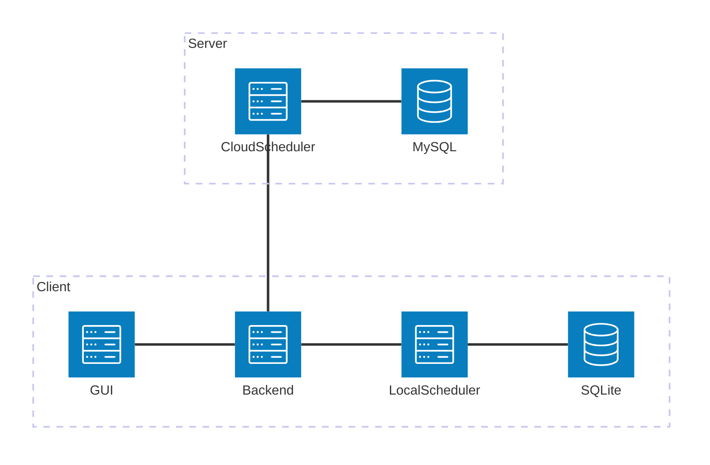

# 基于调度算法的智能时间管理优化系统

## 核心功能

1. 基于调度算法（轮转调度算法，短作业有限算法，先来先服务算法……）实现本地时间管理（简单说为每个任务安排具体执行的日期和时间段）
2. 基于机器学习或强化学习的AI时间管理方案（部署于服务器，匿名或加密数据）作为可选调度方案

## 非核心功能
### 本地部分
1. SQLite数据库
2. 客户端支持多种任务信息的录入：（类似mod排序工具loot对mod的进行排序时依赖的metadata）
    - （必填）任务名称
    - （可选）任务描述
    - （必填，默认为平均值）任务优先级（支持基础数字优先级或“比xxx任务更优先/更不优先”（就是在xxx任务的优先级基础上加减））
    - （可选，默认为任务创建时间）任务开始时间
    - （可选）任务结束时间
    - （按钮切换）任务状态（待完成，已完成，待跟进（就是需要等待后续结果但任务确实完成了），已取消/放弃）
    - （自动判断）时间情况（未开始，进行中，已超时，已完成）
    - （可选）任务类型（工作，学习，生活等）
    - （可选）任务周期（每n天，每n周，每n月，每周的若干日（比如每周一和周三，每周工作日））
    - （必填，默认值为1）任务计数（n次）
    - （可选）任务上锁（不可调度的任务）
    - （可选）预计时间
    - …………（待补充）
3. 客户端时间管理小工具：
    - 番茄钟（辅助时间管理）
4. 客户端显示：
    - 任务列表（带不同时间长度的视图，按日，周，月等时间尺度显示）
    - 必要按钮和界面（任务录入，任务调度，任务统计，任务管理，任务修改，番茄钟）
    - 任务反馈（满意度等）
5. 可选的任务调度

### 服务器部分
1. 智能时间管理算法（基于机器学习或强化学习的AI时间管理方案）(通用AI调度，不保留或使用用户信息)
2. 上传匿名数据，返回调度结果
3. 上传的匿名数据用于AI训练学习（参数包括满意度，任务调度后情况等）

## 可选技术
1. Python及相关插件
2. Java
3. Java Spring Boot及相关依赖
4. SQLite
5. Vue2/3及相关插件
6. C语言
7. Html，CSS，JavaScript

## 系统架构设计
