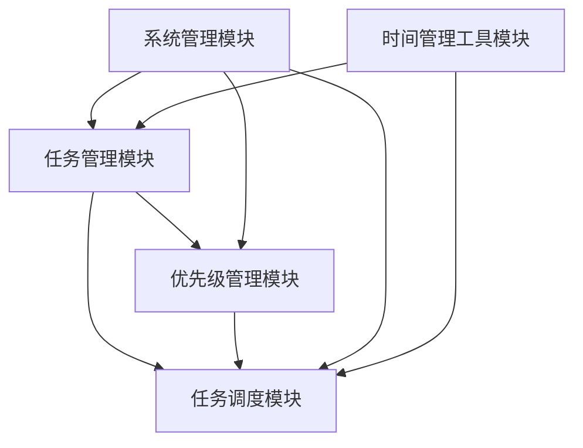
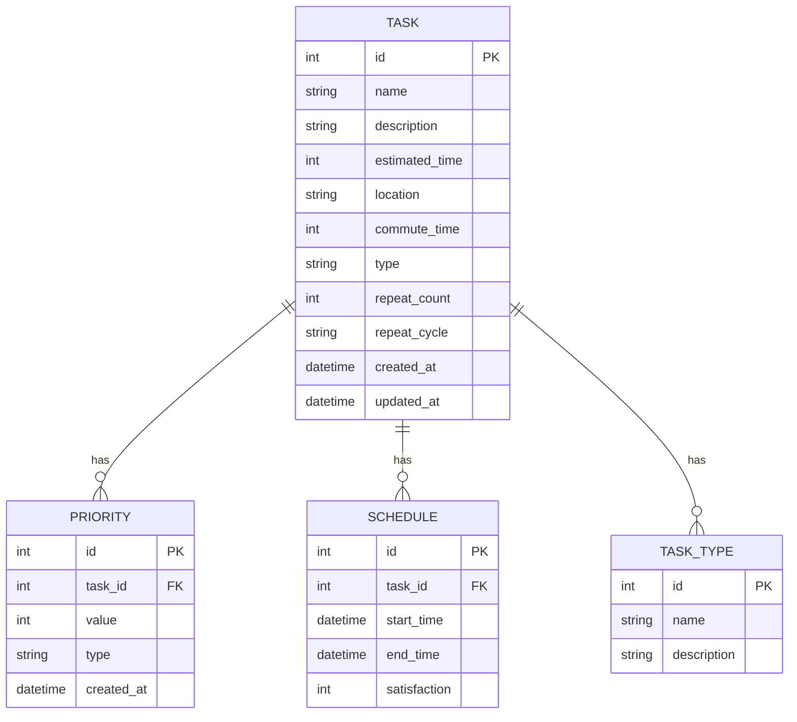
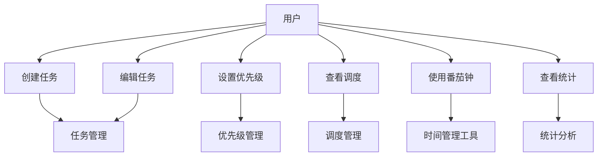

# 引言

## 目的
本文档旨在详细描述任务调度系统（TaskSchedule）的功能需求和非功能需求，为系统设计和开发提供依据。

## 背景
任务调度系统是一个面向普通用户的轻量级任务管理工具，旨在帮助用户更高效地管理日常任务，无需复杂的编程知识或时间管理经验。系统通过智能调度算法自动安排任务，减轻用户时间管理的负担。

## 预期的读者和阅读建议
| 预期读者 | 阅读建议 |
| ------- | -------- |
| 系统设计人员 | 重点关注功能需求和非功能需求部分 |
| 开发人员 | 重点关注功能需求描述和系统约束部分 |
| 测试人员 | 重点关注功能需求描述和性能要求部分 |
| 项目管理人员 | 重点关注系统概述和未来扩展部分 |

# 系统概述

## 系统功能

系统有5个主要模块，分别是任务管理模块、优先级管理模块、任务调度模块、时间管理工具模块和系统管理模块。

## 数据库描述

## 用例图

## 用户特点

| 角色 | 可用功能 |
| --- | -------- |
| 普通用户 | 任务创建、编辑、删除、优先级设置、查看调度、使用番茄钟、查看统计 |
| 管理员 | 系统配置、数据备份、用户管理、AI模型训练 |

## 运行环境要求
- 客户端
    - 操作系统：Windows 10/11, Linux
    - 数据库系统：SQLite
    - 前端框架：Vue + Element
    - 后端语言：Python
- 服务端
    - 操作系统：Windows Server 2019+, Linux
    - 技术储备：Python 3.8+, Java Spring Boot
    - 数据库系统：MySQL

# 功能需求描述

## 任务管理模块

- 使用者：所有用户
- 目的：提供任务的基本管理功能
- 基本事件流
    - 创建任务
        1. 用户点击"新建任务"按钮
        2. 系统显示任务创建表单
        3. 用户填写任务信息（包括任务类型：次数任务、周期任务等）
        4. 用户设置优先级
        5. 系统自动生成任务ID
        6. 系统保存任务信息
    - 编辑任务
        1. 用户选择要编辑的任务
        2. 系统显示任务编辑表单
        3. 用户修改任务信息
        4. 系统保存修改后的信息
    - 删除任务
        1. 用户选择要删除的任务
        2. 系统显示确认对话框
        3. 用户确认删除
        4. 系统删除任务及相关数据

## 优先级管理模块

- 使用者：所有用户
- 目的：提供灵活的优先级设置方式
- 基本事件流
    - 模糊区间选择
        1. 用户选择优先级区间（例如低/中/高）
        2. 系统自动分配具体优先级数值
        3. 系统保存优先级设置
    - 比较式优先级
        1. 用户选择参考任务
        2. 用户选择"更高"或"更低"优先级
        3. 系统计算并分配具体优先级数值
        4. 系统保存优先级设置
    - 直接数值设置
        1. 用户输入具体优先级数值
        2. 系统验证数值唯一性
        3. 系统保存优先级设置

## 任务调度模块

- 使用者：所有用户
- 目的：提供智能的任务调度功能
- 基本事件流
    - 自动调度
        1. 系统获取所有待调度任务
        2. 系统考虑任务优先级、时间约束、通勤时间等因素
        3. 系统根据选择的调度算法（轮转调度、短作业优先、先来先服务等）生成最优调度方案
        4. 系统保存调度结果
    - 手动调整
        1. 用户查看自动调度结果
        2. 用户手动调整任务顺序
        3. 系统保存调整后的调度方案
    - 调度算法切换
        1. 用户选择不同的调度算法
        2. 系统重新计算调度方案
        3. 系统保存新的调度结果

## 时间管理工具模块

- 使用者：所有用户
- 目的：提供辅助时间管理工具
- 基本事件流
    - 番茄钟
        1. 用户启动番茄钟
        2. 系统开始计时（默认25分钟）
        3. 时间到后提醒用户
        4. 记录专注时间
    - 任务统计
        1. 系统收集任务完成情况
        2. 生成任务完成率、时间分配等统计信息
        3. 以图表形式展示统计结果

## 系统管理模块

- 使用者：管理员
- 目的：提供系统配置和管理功能
- 基本事件流
    - 系统配置
        1. 管理员进入系统配置界面
        2. 管理员修改系统参数
        3. 系统保存配置信息
    - AI模型训练
        1. 系统收集匿名用户数据
        2. 训练AI调度模型
        3. 更新云端调度算法

# 非功能描述

## 系统性能要求

1. 系统响应时间：普通操作应在1秒内完成
2. 支持同时管理至少1000个任务
3. 支持至少100个周期性任务
4. 系统启动时间不超过3秒
5. 数据导入导出操作不超过30秒
6. AI调度响应时间不超过5秒

## 系统安全及保密要求

1. 用户数据本地存储
2. 支持数据加密存储
3. 防止未授权访问
4. 敏感操作需要用户确认
5. 定期清理临时文件
6. 云端数据完全匿名化处理

## 系统备份与恢复要求

1. 支持手动和自动备份
2. 备份文件加密存储
3. 支持增量备份
4. 备份文件可导出
5. 支持选择性恢复

## 系统日志

1. 记录用户关键操作
2. 记录系统错误信息
3. 记录性能指标
4. 日志文件定期清理
5. 支持日志导出
6. 记录AI模型训练过程

## 其他

1. 支持多语言界面
2. 支持主题切换
3. 支持快捷键操作
4. 提供在线帮助文档
5. 支持用户反馈功能
6. 支持任务满意度评价 