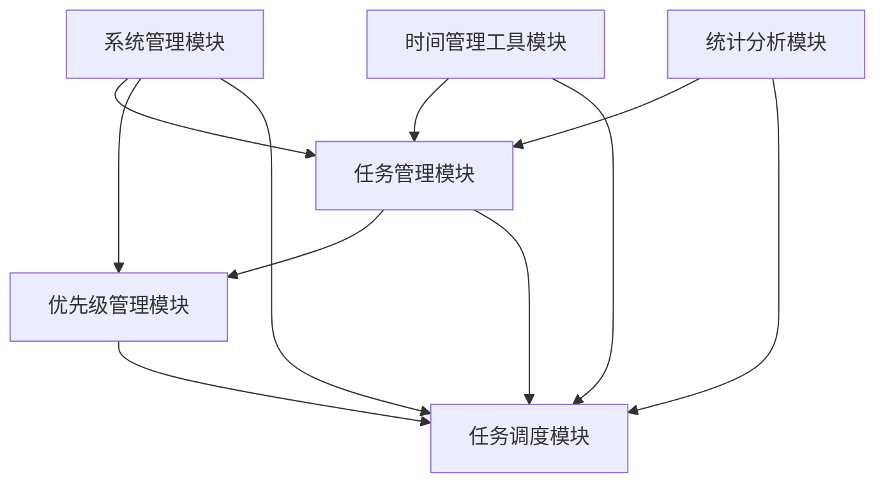
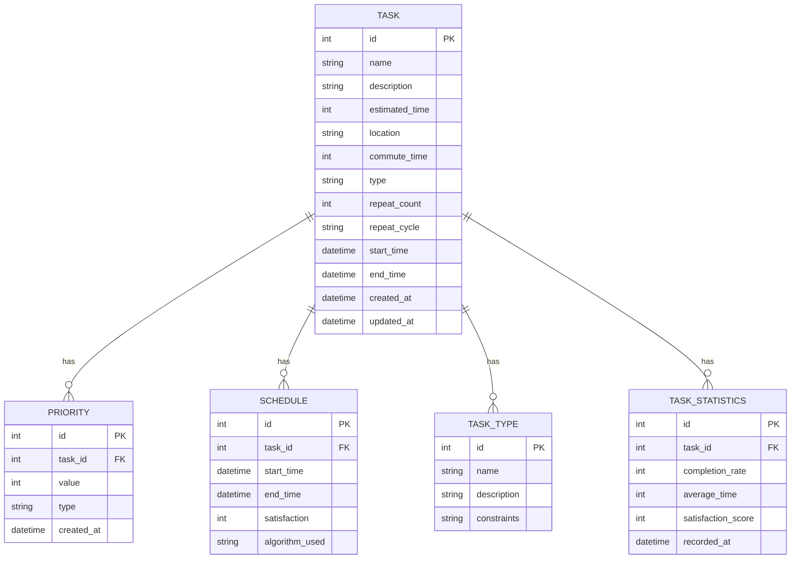
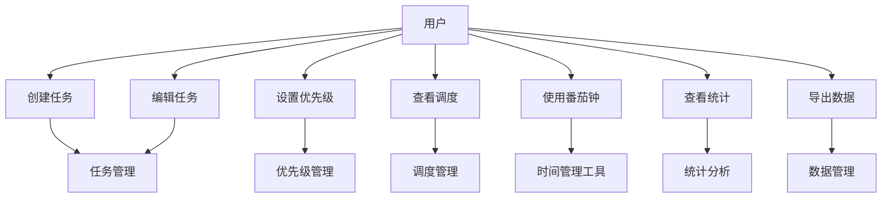

# 引言

## 目的
本文档旨在详细描述任务调度系统（TaskSchedule）的功能需求和非功能需求，为系统设计和开发提供依据。本系统通过智能调度算法帮助用户高效管理日常任务，实现时间管理的自动化和智能化。

## 背景
任务调度系统是一个面向普通用户的轻量级任务管理工具，旨在解决传统待办事项工具只能"记录"而不能"管理"的问题。系统通过创新的优先级选择机制和智能调度算法，自动安排任务，减轻用户时间管理的负担。

## 预期的读者和阅读建议
| 预期读者 | 阅读建议 |
| ------- | -------- |
| 系统设计人员 | 重点关注功能需求和非功能需求部分，特别是调度算法和优先级机制的设计 |
| 开发人员 | 重点关注功能需求描述、系统约束和API接口部分 |
| 测试人员 | 重点关注功能需求描述、性能要求和测试用例部分 |
| 项目管理人员 | 重点关注系统概述、项目里程碑和风险评估部分 |

# 系统概述

## 系统功能

系统有6个主要模块，分别是任务管理模块、优先级管理模块、任务调度模块、时间管理工具模块、统计分析模块和系统管理模块。

## 数据库描述

## 用例图

## 用户特点

| 角色 | 可用功能 |
| --- | -------- |
| 普通用户 | 任务创建、编辑、删除、优先级设置、查看调度、使用番茄钟、查看统计、数据导出 |
| 管理员 | 系统配置、数据备份、用户管理、AI模型训练、系统监控 |

## 运行环境要求
- 客户端
    - 操作系统：Windows 10/11, Linux, macOS
    - 数据库系统：SQLite 3.35+
    - 前端框架：Vue 3 + Element Plus
    - 后端语言：Python 3.8+
    - 内存要求：最小4GB
    - 存储空间：最小1GB
- 服务端
    - 操作系统：Windows Server 2019+, Linux
    - 技术储备：Python 3.8+, Java Spring Boot 2.7+
    - 数据库系统：MySQL 8.0+
    - 内存要求：最小8GB
    - 存储空间：最小10GB

# 功能需求描述

## 任务管理模块

- 使用者：所有用户
- 目的：提供任务的基本管理功能
- 基本事件流
    - 创建任务
        1. 用户点击"新建任务"按钮
        2. 系统显示任务创建表单
        3. 用户填写任务信息
            - 基本信息（名称、描述）
            - 时间信息（预计时间、通勤时间）
            - 任务类型（次数任务、周期任务）
            - 约束条件（时间约束、地点约束）
        4. 用户设置优先级
        5. 系统自动生成任务ID
        6. 系统保存任务信息
    - 编辑任务
        1. 用户选择要编辑的任务
        2. 系统显示任务编辑表单
        3. 用户修改任务信息
        4. 系统验证修改的合法性
        5. 系统保存修改后的信息
    - 删除任务
        1. 用户选择要删除的任务
        2. 系统显示确认对话框
        3. 用户确认删除
        4. 系统检查任务依赖关系
        5. 系统删除任务及相关数据

## 优先级管理模块

- 使用者：所有用户
- 目的：提供灵活的优先级设置方式
- 基本事件流
    - 模糊区间选择
        1. 用户选择优先级区间（低/中/高）
        2. 系统自动分配具体优先级数值
        3. 系统保存优先级设置
    - 比较式优先级
        1. 用户选择参考任务
        2. 用户选择"更高"或"更低"优先级
        3. 系统计算并分配具体优先级数值
        4. 系统保存优先级设置
    - 直接数值设置
        1. 用户输入具体优先级数值
        2. 系统验证数值唯一性
        3. 系统保存优先级设置
    - 自动调整
        1. 系统根据任务完成情况
        2. 自动调整任务优先级
        3. 通知用户优先级变更

## 任务调度模块

- 使用者：所有用户
- 目的：提供智能的任务调度功能
- 基本事件流
    - 自动调度
        1. 系统获取所有待调度任务
        2. 系统考虑以下因素：
            - 任务优先级
            - 时间约束
            - 通勤时间
            - 用户习惯
            - 历史完成情况
        3. 系统根据选择的调度算法生成最优调度方案
        4. 系统保存调度结果
    - 手动调整
        1. 用户查看自动调度结果
        2. 用户手动调整任务顺序
        3. 系统验证调整的合法性
        4. 系统保存调整后的调度方案
    - 调度算法切换
        1. 用户选择不同的调度算法
        2. 系统重新计算调度方案
        3. 系统保存新的调度结果
        4. 系统记录算法使用情况

## 时间管理工具模块

- 使用者：所有用户
- 目的：提供辅助时间管理工具
- 基本事件流
    - 番茄钟
        1. 用户启动番茄钟
        2. 系统开始计时（默认25分钟）
        3. 时间到后提醒用户
        4. 记录专注时间
        5. 更新任务完成情况
    - 任务统计
        1. 系统收集任务完成情况
        2. 生成统计信息：
            - 任务完成率
            - 时间分配
            - 效率分析
            - 习惯分析
        3. 以图表形式展示统计结果
        4. 提供改进建议

## 统计分析模块

- 使用者：所有用户
- 目的：提供任务完成情况分析
- 基本事件流
    - 数据收集
        1. 系统自动收集任务数据
        2. 记录任务完成情况
        3. 记录用户满意度
    - 数据分析
        1. 生成任务完成率统计
        2. 分析时间利用效率
        3. 识别时间管理问题
    - 报告生成
        1. 生成每日/每周/每月报告
        2. 提供改进建议
        3. 导出分析报告

## 系统管理模块

- 使用者：管理员
- 目的：提供系统配置和管理功能
- 基本事件流
    - 系统配置
        1. 管理员进入系统配置界面
        2. 管理员修改系统参数
        3. 系统保存配置信息
    - AI模型训练
        1. 系统收集匿名用户数据
        2. 训练AI调度模型
        3. 更新云端调度算法
    - 系统监控
        1. 监控系统性能
        2. 记录错误日志
        3. 生成监控报告

# 非功能描述

（请无视此部分。此项目为个人开发且仅作为毕业设计，不作为项目运营或发布）
论文撰写时如有需要，才查看同目录下的 **(请无视)非功能需求.md** 文档，path = (请无视)非功能需求.md