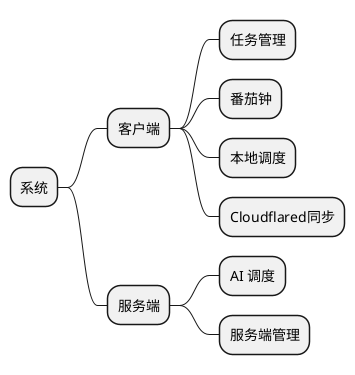
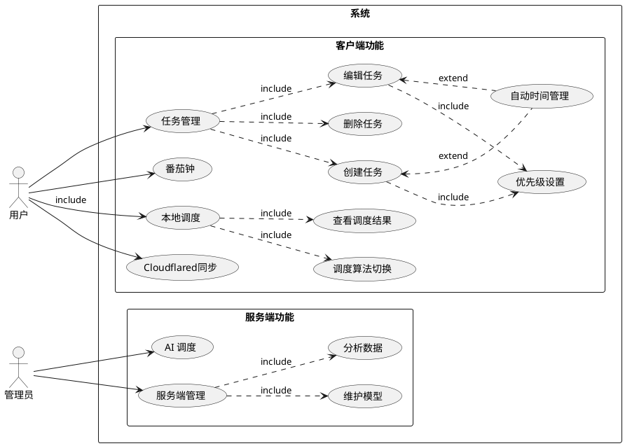

# 引言

## 目的
本文档旨在详细描述任务调度系统（TaskSchedule）的需求分析，为开发团队提供清晰的功能需求指导。通过本文档，开发团队可以了解系统的核心功能、用户需求和技术要求。

## 背景
1. 系统名称：基于调度算法的智能时间管理优化系统（TaskSchedule）
2. 任务提出者：个人开发者
3. 开发者：个人开发者
4. 用户：需要智能时间管理的个人用户
5. 运行环境：Windows/macOS/Linux客户端，可选Linux服务端

## 预期的读者和阅读建议

| 预期读者   | 阅读建议                               |
| ---------- | -------------------------------------- |
| 开发人员   | 重点关注功能需求描述和技术要求部分     |
| 测试人员   | 重点关注功能需求描述和系统性能要求部分 |
| 项目管理者 | 重点关注系统概述和整体功能描述部分     |

# 系统概述

## 系统功能
系统有6个主要模块，分别是任务管理，番茄钟，本地调度，Cloudflared同步，AI 调度，服务端管理

## 数据库描述
pass

## 用例图

## 用户特点

| 角色     | 可用功能                             |
| -------- | ------------------------------------ |
| 普通用户 | 任务管理、调度管理、番茄钟、数据同步 |
| 管理员   | AI调度、模型维护、性能监控           |

## 运行环境要求
- 客户端
    - 操作系统：Windows 10/11, macOS 10.15+, Linux
    - 技术储备：Python 3.8+, Vue.js, SQLite
    - 数据库系统：SQLite
- 服务端（可选）
    - 操作系统：Linux
    - 技术储备：Java Spring Boot, Python
    - 数据库系统：MySQL
