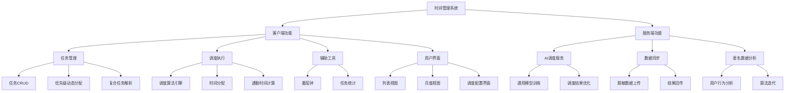
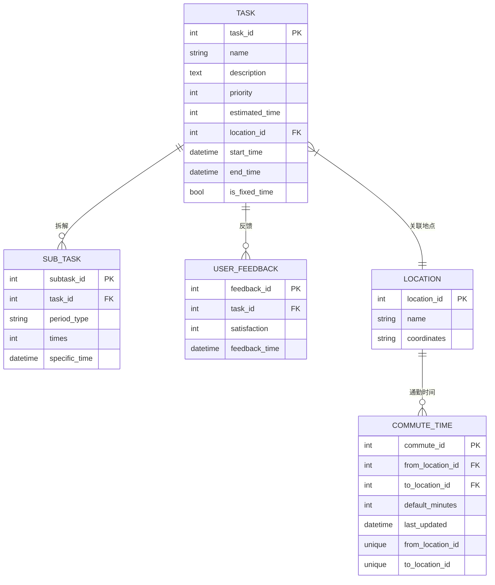
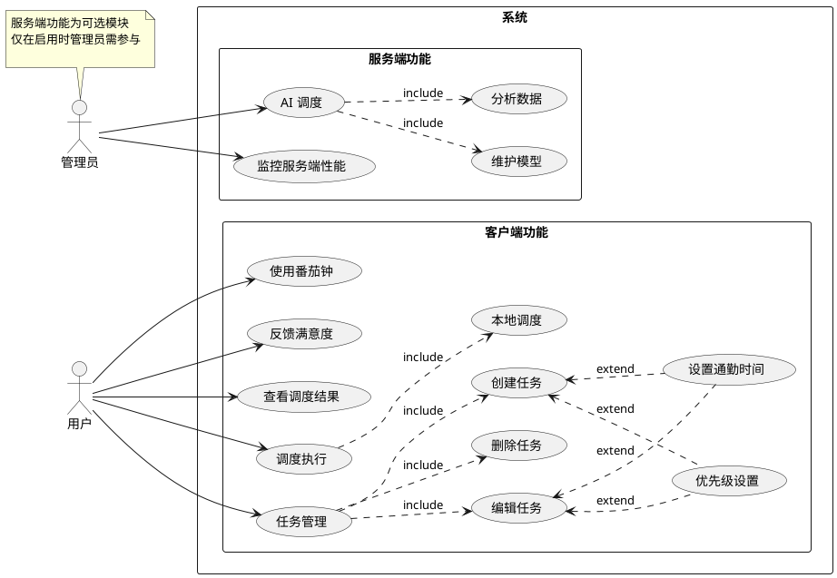

# 引言

## 目的
本文档旨在详细描述任务调度系统（TaskSchedule）的功能需求和非功能需求，为系统开发提供明确的指导。

## 背景
当前市场上的时间管理工具大多仅提供任务记录功能，缺乏智能调度能力。本系统旨在通过引入CPU调度算法，实现任务的自动安排，降低用户时间管理成本。

## 预期的读者和阅读建议

| 预期读者 | 阅读建议 |
| ------- | -------- |
| 开发人员 | 重点关注功能需求和技术实现细节 |
| 产品经理 | 关注系统整体功能和用户交互设计 |
| 测试人员 | 关注功能需求和非功能需求中的测试要点 |
| 项目管理者 | 关注系统整体架构和开发计划 |

# 系统概述

## 系统功能

系统包含以下主要模块：
任务管理、调度执行、辅助工具、用户界面、AI调度服务、数据同步、匿名数据分析

## 数据库描述

## 用例图

## 用户特点

| 角色 | 可用功能 |
| --- | -------- |
| 普通用户 | 任务管理、优先级设置、查看调度结果、使用时间工具 |
| 高级用户 | 所有普通用户功能 + 自定义调度算法、直接设置优先级数值 |
| 管理员 | 所有高级用户功能 + 系统配置、数据管理 |

## 运行环境要求

- 客户端
    - 操作系统：Windows 10及以上、macOS 10.15及以上、主流Linux发行版
    - 技术储备：Vue.js、Element UI、Python 3.8+
    - 数据库系统：SQLite 3.30+
- 服务端（可选）
    - 操作系统：Linux服务器
    - 技术储备：Java Spring Boot、Python 3.8+
    - 数据库系统：MySQL 8.0+

# 功能需求描述

## 任务管理模块

- 使用者：所有用户
- 目的：提供任务的创建、修改、删除和查询功能
- 基本事件流：
    - 创建新任务
        - 输入任务基本信息（名称、描述、预计时间等）
        - 设置任务周期和完成次数
        - 选择任务时间段要求
    - 修改任务
        - 选择要修改的任务
        - 修改任务信息
        - 保存修改
    - 删除任务
        - 选择要删除的任务
        - 确认删除
    - 查询任务
        - 按条件筛选任务
        - 查看任务详情

## 优先级管理模块

- 使用者：所有用户
- 目的：提供灵活的优先级设置机制
- 基本事件流：
    - 模糊优先级选择
        - 选择优先级区间（低/中/高）
        - 系统自动分配具体优先级数值
    - 比较式优先级选择
        - 选择参考任务
        - 选择更高/更低优先级
        - 系统自动计算新优先级
    - 直接优先级设置（高级用户）
        - 输入具体优先级数值
        - 系统验证数值有效性

## 调度算法模块

- 使用者：系统
- 目的：自动安排任务执行时间
- 基本事件流：
    - 收集待调度任务
    - 应用选定调度算法
    - 生成调度结果
    - 更新任务时间安排

## 时间管理工具模块

- 使用者：所有用户
- 目的：提供辅助时间管理功能
- 基本事件流：
    - 启动番茄钟
        - 设置工作时间
        - 设置休息时间
        - 开始计时
    - 查看时间统计
        - 选择统计周期
        - 查看时间分配情况

## 数据同步模块（可选）

- 使用者：所有用户
- 目的：实现数据云端备份和同步
- 基本事件流：
    - 上传数据
        - 选择要同步的数据
        - 执行同步操作

# 非功能描述

（请无视此部分。此项目为个人开发且仅作为毕业设计，不作为项目运营或发布）
论文撰写时如有需要，才查看同目录下的 **(请无视)非功能需求.md** 文档，path = (请无视)非功能需求.md
