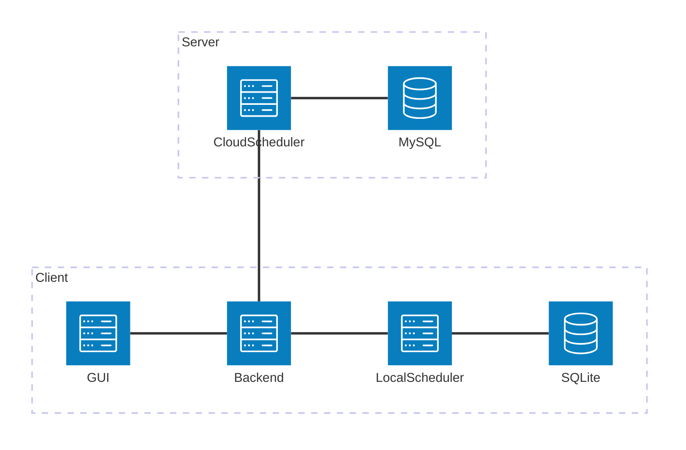

# 智能时间管理优化系统 - 需求分析文档（软件工程本科毕业设计）

## 1. 引言

### 1.1 编写目的
本文档的目的是对“基于调度算法的智能时间管理优化系统”的需求进行详细分析，定义系统的功能需求、性能需求、接口设计以及其他非功能性需求，为后续的系统设计、开发与测试提供依据。目标读者为系统开发者本人及协作的AI，用于明确开发范围与目标。

### 1.2 项目背景
随着任务数量增多及复杂度提升，手动时间管理难以高效适应用户需求。本系统旨在引入传统调度算法与轻量化 AI 强化学习模型，实现自动化、智能化、个性化的时间管理，从而提升用户的任务完成效率和日程安排舒适度。重点在于可落地实现，AI 模型需支持在 GTX 1660 级别显卡下运行。

### 1.3 术语定义
- **调度算法**：用于确定任务执行顺序的算法，如 FCFS、SJF 等。
- **AI调度**：指通过机器学习或强化学习模型生成的调度方案。
- **任务优先级**：表示任务执行的相对重要性和紧急程度。
- **番茄钟**：一种时间管理工具，将任务时间切分为若干个专注工作段与短暂休息段。
- **任务周期性**：任务是否按固定时间间隔重复出现。

---

## 2. 总体描述

### 2.1 产品功能概述
本系统主要包括以下模块：
- 本地调度模块：基于常见CPU调度算法对用户任务安排时间
- AI调度模块：基于强化学习生成优化调度结果
- 任务录入与管理模块：支持复杂任务属性录入与周期任务设置
- 用户交互界面：提供多视图任务浏览、反馈与番茄钟工具
- 数据反馈与学习模块：基于用户满意度反馈优化 AI 模型

### 2.2 用户特征
- **单机用户**：日常使用者，在本地进行任务管理与调度
- **进阶用户**：希望获得云端AI调度或者自行设计编写部署调度算法

### 2.3 运行环境
- 客户端操作系统：Windows/Linux/macOS
- 服务端环境：支持容器部署（Docker），运行Python AI模型
- 数据库：
  - 客户端：SQLite 或其他用户可控轻量数据库
  - 服务端：MySQL，存储脱敏任务信息与反馈数据

---

## 3. 功能需求

### 3.1 本地任务调度模块
- 支持以下调度算法：
  - FCFS（先来先服务）
  - SJF（短作业优先）
  - 优先级调度
  - 轮转调度
- 用户可在设置中选择默认调度策略，也可在调度时临时更改
- 系统可自动为任务安排时间段并展示调度结果

### 3.2 AI智能调度模块（云端）

该模块使用轻量级强化学习模型，在云端或本地GPU（如 GTX 1660）上运行，提供任务排程优化服务，目标为提升任务完成率、避免时间拥挤并兼顾用户满意度。

#### 3.2.1 算法选型
- 初步采用 DQN（Deep Q-Network），适合中小任务规模、低资源训练
- 替代方案：DDPG 或 PPO，用于后续迭代优化
- 推理与在线微调在云端执行，用户本地只调用接口，不需训练

#### 3.2.2 状态空间设计
每一个状态向量包含：
- 当前系统时间
- 剩余时间段密度
- 待调度任务的优先级、耗时、周期、锁定状态
- 可选：最近用户满意度反馈（范围0~1）

#### 3.2.3 动作空间
- 指定任务放置在指定时间段
- 跳过当前任务、不调度
- 填补指定空档等

#### 3.2.4 奖励函数设计
奖励函数 = α × 完成任务数量 + β × 时间利用率 + γ × 用户满意度

推荐初始权重：
- α = 1.0（完成优先）
- β = 0.5（时间填满）
- γ = 1.5（用户体验）

#### 3.2.5 模型规模与资源控制
- 使用2~3层MLP（每层128~256节点），显存消耗 < 4GB
- 初始训练集为手动构造的小规模任务数据，可扩展至上万条
- 支持 GTX 1660 或同级 GPU 推理

#### 3.2.6 用户交互逻辑
- 用户上传脱敏任务列表，发起调度请求
- 系统返回优化结果
- 用户可对比原始方案与AI方案，并反馈满意度（用于在线微调）

#### 3.2.7 异常处理与回退机制
- 若AI失败或无响应，回退至本地算法
- 提供“恢复上一次调度”按钮，支持手动撤销AI建议

#### 3.2.8 小结与可行性说明
本模块确保运行于 GTX 1660 级别显卡或云端低成本GPU服务器，模型架构轻量，训练数据量控制可调，适合毕业设计原型开发，未来可扩展更强AI。

### 3.3 任务录入与管理
- 支持任务的增删查改（CRUD）
- 支持字段：
  - 名称（必填）
  - 描述（可选+可空）
  - 优先级（必填。下列三种方式任选其一）：
    - 数值填写（如705，346）
    - 模糊等级（如：低：0~300，中：301~700，高：701~1000。仅作为示例，模糊级别可调，最大数值可调） 
    - 相对调整（比某任务更优先，在某任务基础上+- 1）
  - 起止时间（可选+非空。不填则为任务创建时间）
  - 预计时间（可选+非空。不填则为60分钟）
  - 周期设置（可选+可空。每周，每月，每年，每n周，每n月，每n年）
    - 复合周期（可选+可空。如每周的周一，每月的第二周和第四周，每年的7月8月9月，等等以此类推）
  - 执行次数（可选+非空。不填则为1。周期内应完成n次）
  - 状态：（可选+非空。不填则为待完成）待完成、已完成、待跟进（完成任务但是要等待反馈）、已取消
  - 时间状态：（系统自动判断，不可手动调整）未开始、进行中、即将截止、超时
  - 类型标签：（可选+可空）编辑/选择 已有tag，添加 没有的tag，
  - 上锁状态：（可选+非空。不填则为不上锁，可以调度）是否参与调度（如课程、会议为锁定）

---

## 4. 性能需求

- 本系统为原型系统，性能部分以用户体验测试为准
- 不设具体响应时间指标，重点为“可用、可操作、响应可接受”

---

## 5. 设计约束

- 所有本地数据使用 SQLite 存储
- AI 模型仅处理脱敏信息，不涉及身份或隐私字段
- 前后端分离架构，支持 Web 客户端 + REST 接口联动
- AI训练与推理环境需兼容 GTX1660 / Docker / Python

---

## 6. 外部接口需求

### 6.1 用户接口
- 提供图形界面，支持：
  - 任务录入、管理
  - 调度算法选择
  - 番茄钟控制器
  - AI推荐调度与对比结果查看
  - 用户满意度反馈入口

---

## 7. 数据需求

- 所有任务信息、调度结果、用户反馈需本地持久化
- 数据可导出为JSON或CSV格式，便于备份与迁移
- 云端训练模型所用数据需严格脱敏，确保安全性

---

## 8. 安全性需求

- 本地数据可加密存储（开发时可选实现）
- 所有上传数据自动脱敏
- 不记录任何用户身份、设备信息
- 建议实现隐式登录/注册机制，缓解NAT网络问题并防止脚本攻击

---

## 9. 可扩展性与维护性

- 调度算法采用插件式管理，可切换或新增算法模块
- 支持任务字段扩展、新任务类型引入
- 支持服务端替换/升级AI模型

---

## 10. 其他需求

- 界面需简洁、可响应、适配不同分辨率屏幕
- 数据导入导出功能：支持WebDAV/本地文件等方式
- 优先级机制(重要)：一种基于模糊优先级设定的，面向用户的纯数值优先级设计
  - 若干（比如2000个优先级）优先级按多等级层次（如极高、高、中、低）大致分割
  - 同一层级任务按创建时间排序（如选择“中”优先级并先后创建两个任务，则先创建的优先级大于后创建的，并且留下10~50的空优先级用于相对优先级插空）
  - 插入任务时动态分配优先级值（如：在“高”优先级中插入比现有最高还高的任务 → 分配新优先级，即现有最高优先级+1）
  - 任务完成后释放优先级值，避免数值耗尽或优先级拥塞

## 11. 系统架构设计

 - 用户 -操作-> GUI -沟通-> 后端 --> SQLite的CRUD+调度（本地）  /  AI推理+AI训练+MySQL的存储（服务器）

