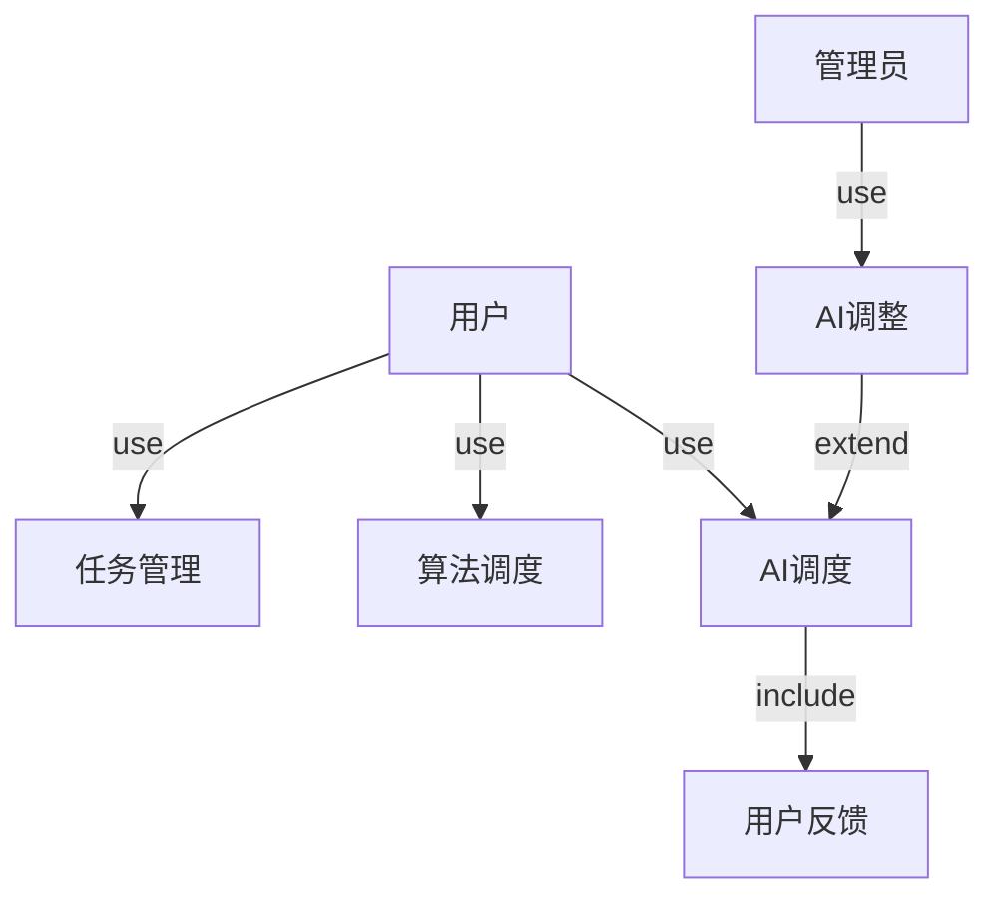

# 引言

## 目的
本文档旨在对"基于调度算法的智能时间管理优化系统"的需求进行详细分析，定义系统的功能需求、性能需求、接口设计以及其他非功能性需求，为后续的系统设计、开发与测试提供依据。

## 背景
随着任务数量增多及复杂度提升，手动时间管理难以高效适应用户需求。本系统旨在引入传统调度算法与轻量化 AI 强化学习模型，实现自动化、智能化、个性化的时间管理，从而提升用户的任务完成效率和日程安排舒适度。重点在于可落地实现，AI 模型需支持在 GTX 1660 级别显卡下运行。

## 预期的读者和阅读建议

| 预期读者 | 阅读建议 |
| ------- | -------- |
| 系统开发者 | 重点关注系统整体架构和功能模块 |
| AI协作助手 | 详细阅读功能需求描述和技术要求 |
| 测试人员 | 关注功能需求和非功能需求的具体实现细节 |

# 系统概述

## 系统功能

系统包含以下主要模块：
1. 本地调度模块：基于常见CPU调度算法对用户任务安排时间
2. AI调度模块：基于强化学习生成优化调度结果
3. 任务录入与管理模块：支持复杂任务属性录入与周期任务设置
4. 用户交互界面：提供多视图任务浏览、反馈与番茄钟工具
5. 数据反馈与学习模块：基于用户满意度反馈优化 AI 模型

```mermaid
architecture-beta
    service sys[system]
    service local[local schedule]
    service task[task manage]
    service UI[user interface]

    service AI[AI schedule]
    service feedback[user feedback]

    junction junctionFirst
    junction junctionFirstLeft
    junction junctionFirstRight
    junction junctionFirstRight2

    junction junctionSecondLeftCenter
    junction junctionSecondLeftLeft
    junction junctionSecondLeftRight

    junction junctionSecondRightCenter
    junction junctionSecondRightLeft
    junction junctionSecondRightRight
    junction junctionSecondRightRight2

    
    sys:B -- T:junctionFirst
    junctionFirst:L -- R:junctionFirstLeft
    junctionFirst:R -- L:junctionFirstRight
    junctionFirstRight:R -- L:junctionFirstRight2

    junctionFirstLeft:B -- T:junctionSecondLeftCenter
    junctionSecondLeftCenter:R -- L:junctionSecondLeftLeft
    junctionSecondLeftCenter:L -- R:junctionSecondLeftRight


    junctionFirstRight2:B -- T:junctionSecondRightCenter
    junctionSecondRightCenter:R -- L:junctionSecondRightLeft
    junctionSecondRightCenter:L -- R:junctionSecondRightRight

    junctionSecondLeftLeft:B -- T:AI
    junctionSecondLeftRight:B -- T:feedback
    junctionSecondRightCenter:B -- T:local
    junctionSecondRightLeft:B -- T:task
    junctionSecondRightRight:B -- T:UI
```

## 数据库描述

(暂不设计)

## 用例图



## 用户特点

| 角色 | 可用功能 |
| --- | -------- |
| 单机用户 | 本地任务管理与调度 |
| 进阶用户 | 云端AI调度、自定义调度算法、任务精细化管理 |

## 运行环境要求
- 客户端
    - 操作系统：Windows/Linux/macOS
    - 技术储备：Python + FastAPI、VUE技术
    - 数据库系统：SQLite
- 服务端
    - 操作系统：支持Docker的Linux系统
    - 技术储备：Python AI模型，Spring Boot技术
    - 数据库系统：MySQL

# 功能需求描述

## 本地调度模块

- 使用者：所有用户
- 目的：提供基础任务调度功能
- 基本事件流
    - 选择调度算法（FCFS/SJF/优先级/轮转）
    - 设置默认调度策略
    - 自动安排任务时间段
    - 展示调度结果

## AI调度模块

- 使用者：进阶用户
- 目的：提供智能任务调度
- 基本事件流
    - 上传任务列表
    - 发起调度请求
    - 接收优化结果
    - 提供满意度反馈

## 任务管理模块

- 使用者：所有用户
- 目的：管理任务信息
- 基本事件流
    - 创建/编辑任务
    - 设置任务属性
    - 管理周期任务
    - 设置优先级
    - 管理标签

## 用户界面模块

- 使用者：所有用户
- 目的：提供交互界面
- 基本事件流
    - 任务录入
    - 算法选择
    - 番茄钟控制
    - 查看调度结果
    - 提供反馈

## 数据反馈模块

- 使用者：系统
- 目的：优化AI模型
- 基本事件流
    - 收集用户反馈
    - 更新训练数据
    - 优化模型参数
    - 更新调度策略

# 非功能描述

## 系统性能要求

1. 系统响应时间：以用户体验测试为准
2. 并发处理能力：支持单机用户使用
3. AI模型性能：服务端支持GTX16系显卡算力运行

## 系统安全及保密要求

1. 本地数据可加密存储
2. 上传数据自动脱敏
3. 不记录用户身份信息
4. 实现隐式登录机制

## 系统备份与恢复要求

1. 本地数据持久化存储
2. 支持数据导出为JSON/CSV

## 系统日志

1. 操作日志：记录用户操作
2. 系统日志：记录运行状态
3. 错误日志：记录异常情况

## 其他

1. 界面简洁响应式设计
2. 支持数据导入导出
3. 优先级机制支持动态分配
4. 支持插件式算法管理
5. 支持任务字段扩展 